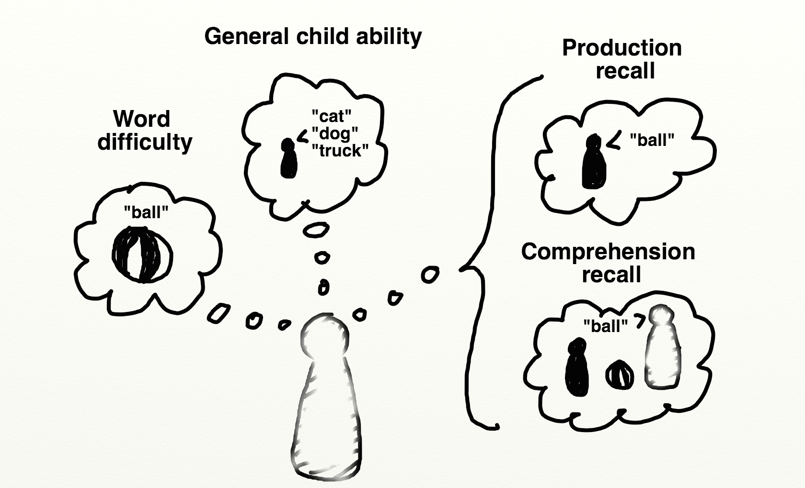

# Measurement Properties of the CDI {#psychometrics}

```{r gram-prep_data, child="_psychometrics.Rmd", eval=FALSE}
```

Many researchers are initially shocked to hear that one of the most important methods for studying child language is parent report. Yet, as we argued in Chapter \@ref(intro-practical), alternative methods like naturalistic observation or lab experiments can be biased, and are quite costly to revisit at scale. Thus, the goal of this chapter is to revisit the strengths and weaknesses of parent report in depth, since the remainder of our manuscript depends on the use of CDI data. 

Broadly speaking, we would like to provide evidence for the reliability and validity of the CDI. Many studies provide evidence for reliability in the form of concurrent and longitudinal correlations between CDI scores and validity in the form of correlations between the CDI and other language measures; some of the most prominent of these studies are cited below and others are reviewed in @fenson2007. Here we address some issues that have received a little less attention: in the first part, we discuss the limitations of the CDI (and the design features that address these limitations); in the second part, we use longitudinal data to examine the test-retest reliability of the CDI; and in the third part, we present evidence for the measurement properties of the CDI (including comprehension questions) from a psychometric perspective.

## Strengths and limitations of parent report

Although the standardization of parent reports using the CDI contributes to the availability of large amounts of data in a comparable format, there are significant limitations to the parent report methodology that are important to understand [@tomasello1994; @feldman2000]. To do so, it is useful to reflect on what it means when a parent reports that their child "understands" or "understands and says" a word. In an ideal world, the parent's responses would be an unbiased reflection of their observations of their child's language development. For example, when asked if their child produces the word *ball*, a parent is likely recalling situations in which their child has used the word *ball* correctly, and then reporting on the success or failure of this process of recollection. Of course, this judgment clearly depends on the parent's ability to accurately judge that the child intended to say the word *ball*, that the child's target word form was *ball*, and that the child has some meaning for the word form *ball* that at least approximates the expected meaning. There are also a number of other sources of information that the parent might bring to bear on these judgments. 

```{r psycho-parentsketch, fig.cap="The intuitive structure of parent report."}

```

The figure shows a sketch of the process of parent report. For each word on the CDI, the parent is asked to report whether their child has produced or comprehended the word. This report could depend on direct recall of a particular case when their child actually produced or showed comprehension. But in addition to these factors, parents probably draw on their general assessment of the difficulty of the word and on their overall assessment of the child's linguistic abilities. As even this simple sketch shows, parent report judgments are based on a fairly complex set of factors. And hence there are legitimate concerns about the ability of parents to provide detailed and specific knowledge about their children's language. We discuss specific concerns below. 

First, parents may be biased observers generally. Most parents do not have specialized training in language development, and may not be sensitive to subtle aspects of language structure and use. Further, a natural pride in the child and a failure to critically test their impressions may cause parents to overestimate the child's ability; conversely, frustration in the case of delayed language may lead to underestimates. Parent report is most likely to be accurate under three general conditions: (1) when assessment is limited to current behaviors, (2) when assessment is focused on emergent behaviors, and (3) when a primarily recognition format is used. Each of these conditions acts to reduce demands on the respondent's memory. For example, parents are better able to choose from a list of items that are likely candidates, rather than requiring that the parents generate the list themselves. In addition, parents are likely to be better able to report on their child's language at the present time than at times past and when their child is actively learning the particular words on the list (e.g., names for animals). 

Second, parent reports likely suffer from a number of biases that interact with sub-portions of the forms and the ages of the target children. For example, it is likely that parents may have more difficulty reporting on children's comprehension or production of function words (e.g., *so*, *then*, *if*) than content words (e.g., *baby*, *house*)--relying more on their estimates of the words general difficulty. We return to this question below in our psychometric analyses. Moreover, in typically-developing samples, parents can track their child's receptive vocabulary to about 16-18 months, after which it is too large to monitor. Expressive vocabulary can be monitored until about 2.5 - 3 years, after which the number of words a child can say becomes too large. Different instrument developers make different choices about the ceiling of CDI-type forms but relatively few have considered CDI-type parent report for measuring older children's vocabularies [but cf. @libertus2015].

The CDI instruments capitalize on the greater ease of recognition, as contrasted with free recall, to help offset these memory limitations. That is, it is better to ask parents to report on their child's vocabulary by selecting words from a list of possible words rather than having them write down all the words they can recall hearing their child use (or, even worse, asking the global question "Does your child know at least 50 words?" that is so commonly used in pediatric assessments). 

In addition, asking parents to reflect on their child's language abilities may be particularly difficult for early vocabulary and especially for early comprehension. As @tomasello1994 point out, for the youngest children, especially 8 - 10 month olds, vocabulary comprehension scores can be surprisingly high, possibly reflecting a lack of clarity in what the term "understands"
means for parents of children at this young age. On the other hand, more recent evidence has suggested that children in this age range do plausibly have some comprehension skill even if it is somewhat fragmentary [@tincoff1999;@tincoff2012;@bergelson2012;@bergelson2013;@bergelson2015]. Thus, the degree to which very early comprehension reports are artifactual -- or were actually ahead of the research literature -- is unknown. (Resolving this question will require detailed studies of the correspondence between parent reports and experimental data for individual children). Below we assess some of the measurement properties of comprehension items, but we are unable to resolve the issue fully. 

One study that bears on the earliest production data is @schneider2015, who compiled a number of sources of data on children's first words. Surprisingly, they found relatively few differences for the age and topic distribution of this very salient milestone across datasets collected via a number of different methods, including concurrent (CDI) and retrospective report. The age at which a first word was reported was also relatively similar between CDI data and the concurrent diary reports of a sample of psycholinguists (though some CDI data appeared to be shifted a little bit earlier such that more parents were reporting first words in the 7-9 month period). 

Third, there is some evidence that variability in reporting biases may be moderated by factors such as SES [@feldman2000; @fenson2000; @feldman2005]. Some studies suggest that parents from some SES groups may be more likely to underestimate child's abilities [@roberts1999], while others report that parents from lower-SES groups may over-estimate children's abilities, especially comprehension at younger ages [@goldfield1990; @feldman2000). Later studies, however, have shown that for children over 2 years patterns of validity were consistent in lower and higher-SES groups [@feldman2005; @reese2000]. Thus, SES-differences could reflect valid delays in children’s language development that parallel those obtained with different methods, such as naturalistic observation or standardized tests [e.g., @hammer2010]. 

<!-- A unique and important extension of this work here is to examine the consistency of SES differences across a large number of languages and hence, language communities which may vary in the social impact of SES gradients. -->

Fourth, as discussed in Chapter \@ref(intro-practical), the items on the original CDI instruments were chosen to be a representative sample of vocabulary for the appropriate age and language [@fenson1994]. The checklists contain some words that most, including the youngest, children are able to understand or produce, some words that are understood or produced by the "average" child, and some which only children who are relatively more advanced will understand or produce. This structure ensures that the list has the psychometric property of capturing individual differences in vocabulary both across younger and older children and across children of different developmental levels. Validity of the CDIs has been demonstrated in reference to both standardized tests and naturalistic language sampling (see Chapter 4 of @fenson2007). 

But the checklists were not originally constructed with the intention that responses on individual items would be reliable. While item-level responses provide useful information about patterns of words that children are likely to understand or produce, responses on the vocabulary checklist do not necessarily license the conclusion that a child would respond appropriately when asked "can you say ____?" by an experimenter in a confrontation naming task. Nonetheless, if parents' observations at the item level reflect any signal -- even in the context of significant influence from other factors -- then this signal should be observable by aggregating together data from many children. Thus, the item-level analyses we present in Chapter \@ref(aoapred) (for example) are not predicated on an assumption of high item-level reliability for individual children. 

Fifth, while the lengths of the vocabulary checklists on the CDIs may give the impression that they yield an estimate of the child's full vocabulary, in fact the vocabulary size estimates only reflect a child's relative standing compared to other children assessed with the same list of words [see @mayor2011 for discussion]. Such estimates should not be misconstrued as a comprehensive estimate of the child's vocabulary knowledge, as CDI scores likely understate the size of a child's "true" vocabulary substantially, especially for older children. 

<!-- Moreover, while it is tempting to ask parents to indicate additional words that their child might be able to understand or say, users should be aware that including those items may introduce bias in the main CDI estimate unless htey are presented after the primary CDI. -->

Sixth, when a parent reports on a word on the vocabulary checklist, there is no information about the actual form of the word used, and hence, these vocabulary estimates can say little about phonological development (e.g. segmental v. suprasegmental approaches to the analysis of speech). Parents are instructed that they should check that a child can produce a word even if it is pronounced in the child's "special way," and only approximates the adult form. Thus, throughout this book we refrain from analyzing the phonological forms of words reported on CDI instruments (with the exception of Chapter \@ref(aoapred), in which we use word length as a predictor of production). 

Finally, we also gain little information about the frequency with which children use a particular word in their spontaneous speech, nor can we know the range of contexts in which individual lexical items are used (e.g., is that word used productively vs. in a memorized chunk of speech). Thus, the vocabulary size that is captured by the CDIs reflects the number of different word types (not tokens) that the child is able to understand or produce, with little information about nuances in meaning that might be reflected in actual usage. 

In sum, despite these limitations, when used appropriately, the CDI instruments yield reliable and valid estimates of total vocabulary size. Because the instruments were designed to minimize bias by targeting current behaviors and asking parents about highly salient features of their child's abilities, they have proven to be an important tool in the field. Dozens of studies demonstrate concurrent and predictive relations with naturalistic and observational measures, in both typically-developing and at-risk populations [e.g., @dale1996; @thal1999; @marchman2002]. In addition, a variety of recent work has shown that individual item-level responses can yield exciting new insights, for example about the growth patterns of semantic networks when aggregated across children [@hills2009; @hills2010]. Such analyses have the potential to be even more powerful when applied to larger samples and across languages.

## Longitudinal stability of CDI measurements

The first question that we address here is with regards to the longitudinal stability of CDI reports. A classic test of the reliability of a psychometric instrument is its test-retest correlation. Assessing this correlation for CDIs for a single reporter is a bit impractical however, since -- unlike e.g., a math test with objective answers and different question forms -- this procedure would involve asking a caregiver to fill out the exact same survey twice in a row, and presumably they would remember many of their answers. An alternative possibility would be to measure the same child via multiple caregivers. This procedure was followed by @de-houwer2005, who found that caregivers varied substantially from one another in their responding; but plausibly this is due not only to parent bias but also to the different contexts in which caregivers interact with children (e.g., one caregiver takes the child to the zoo more often, another plays kitchen at home). 

Avoiding the issues of these procedures, we instead examine correlations in CDI measurements across developmental time. There are only a small number of deeply longitudinal corpora in Wordbank, so we will limit our investigation to two languages: Norwegian and English. Furthermore, the largest group of longitudinal data cover the WS form so we restrict to these data for simplicity. Within each of these datasets, the modal number of observations is two, but there are some children with more than 10 CDIs available. 

Differences between a particular individual's measurements could vary for two primary reasons: first, measurement error (parent forgetfulness, mistakes, etc.) and second, true developmental change (learning new words). Since all children's vocabulary increases over time, we can look at the relative magnitudes of CDI scores via correlations; this is our first analysis. Our second analysis attempts to normalize these absolute differences by extracting percentile ranks and finds that this procedure in fact increases longitudinal correlations. Because there are two sources of differences between measurements, when correlations are low, we do not have direct evidence for whether 1) children's relative linguistic abilities are shifting with respect to one another or 2) we are observing measurement error. But when correlations are high, we can assume the converse: measurement error is low *and* developmental stability is relatively high. 

It turns out that this is the case: The first locus for individual differences in language acquisition is the rate of growth. As we will discuss in more detail in Chapter \@ref(vocab), there is substantial variability between children in vocabulary size. This variability appears to be quite stable longitudinally.

```{r psycho-style_long_data}
longitudinal_admins <- admins %>% 
  mutate(langform = paste(language, form)) %>%
  group_by(langform, original_id) %>% 
  count() %>% 
  filter(n > 1) 

n_long_ws <- admins %>%
  filter(original_id %in% longitudinal_admins$original_id, 
         language %in% c("Norwegian", "English (American)"),
         form == "WS") %>%
  group_by(original_id, language, source_name) %>%
  mutate(n_admins = n()) %>%
  filter(n_admins > 1)

n_long_wg <- admins %>%
  filter(original_id %in% longitudinal_admins$original_id, 
         language %in% c("Norwegian", "English (American)"),
         form == "WG") %>%
  group_by(original_id, language, source_name) %>%
  mutate(n_admins = n()) %>%
  filter(n_admins > 1)

ms_ws <- n_long_ws %>%
  group_by(language, age) %>%
  summarise(production = median(production))

ms_wg <- n_long_wg %>%
  group_by(age) %>%
  summarise(production = median(production))
```


```{r psycho-style_long_data_spaghetti}
ggplot(filter(n_long_ws, n_admins > 10, 
              language == "Norwegian"), 
       aes(x = age, y = production, col = fct_reorder(original_id, production))) + 
  geom_line() + 
  # facet_wrap(~language) + 
  scale_colour_discrete(guide = FALSE) + 
  ylab("Words Produced") + 
  xlab("Age (Months)")
```


The figure above shows the trajectories of children (individual colors) who were measured more than ten times, and includes Norwegian data only due to data sparsity issues in English. These trajectories appear quite stable; the ranking of individuals does not appear to change much over the course of several years. We quantify this trend below. This general conclusion -- longitudinal stability of language ability as well as limited measurement error -- is ratified by other studies using different datasets, for example @bornstein2012, who found substantial stability ($r = .84$) between latent constructs inferred from early language at 20 months and later language measured at 48 months. 

```{r psycho-style_long_data_ecdf}
n_cross_ws <- admins %>%
  filter(language %in% c("Norwegian", "English (American)"),
         form == "WS") %>%
  group_by(original_id, language) %>%
  mutate(n_admins = n()) %>%
  filter(n_admins == 1)

# gets percentiles for longitudinal based on cross-sectional. 
get_empirical_percentiles <- function(df) {
  # assumes ages are uniform in this sample
  this_age <- df$age[1]
  this_lang <- df$language[1]
  
  cross_data <- filter(n_cross_ws, 
                       age == this_age, 
                       language == this_lang)
  
  Fn <- ecdf(cross_data$production) 
  
  df$percentile <- Fn(df$production)
  
  return(df)
}

n_long_ws <- n_long_ws %>%
  split(list(.$age,.$language), drop = TRUE) %>%
  map_df(get_empirical_percentiles)
```

```{r psycho-style_long_data_norwegian_ecdf}
ggplot(filter(n_long_ws, n_admins > 10, 
              language == "Norwegian"), 
       aes(x = age, y = percentile, col = fct_reorder(original_id, production))) + 
  geom_line() + 
  scale_colour_discrete(guide = FALSE) + 
  xlab("Age (months)") + 
  ylab("Empirical Percentile")
```

One way to operationalize the question of stability is how children's percentile ranks tend to change over time. We examine this question creating an empirical CDF for each age group.^[We could use a model-based method (e.g., the `gcrq` method used in the Wordbank app and Chapter \@ref(vocab) and \@ref(demographics)) but in practice we have enough data in each of these languages that this method should perform well.] As shown above, these ranks are visually quite stable. 

```{r psycho-style_pairwise_long_cors}
age_binsize <- 2
  
long_cors <- n_long_ws %>%
  unite("id", c("original_id", "source_name")) %>%
  mutate(age = round(age/age_binsize) * age_binsize) %>% # round age into two-month bins
  select(id, language, age, percentile) %>%
  group_by(id, age) %>%
  sample_n(size = 1) %>% # if there are multiple measurements from one age, remove
  ungroup 
  
long_cor_ns <- long_cors %>%
  split(.$language) %>%
  map_df(function(df) {
    language <- df$language[1] 
    df %>% 
      select(-language) %>%
      widyr::pairwise_count(age, id) %>%
      mutate(language = language) %>%
      rename(age1 = item1, 
             age2 = item2)
  })

long_cor_pairs <-  long_cors %>% 
  spread(age, percentile) %>%
  split(.$language) %>%
  map_df(function(df) {
    language <- df$language[1]
    cor_mat <- select(df, -language, -id) %>%
      cor(use = "pairwise.complete.obs") 
    
    as_data_frame(cor_mat) %>%
      mutate(age2 = rownames(cor_mat)) %>%
      gather(age1, cor, -age2) %>%
      mutate(language = language,
             age1 = as.numeric(age1), 
             age2 = as.numeric(age2), 
             dist = age2 - age1) %>%
      filter(dist > 0)
  }) %>%
  left_join(long_cor_ns)

ggplot(filter(long_cor_pairs, n >= 50), 
       aes(x = dist, y = cor, col = age1)) +
  geom_point(aes(size = n)) + 
  geom_smooth(method = "lm", method.args = list(weight = n)) + 
  facet_wrap(~language) + 
  ylab("Correlation") + 
  xlab("Measurement Gap (Months)") + 
  viridis::scale_color_viridis(name = "Starting Age") + 
  scale_size_continuous(name = "N")  + 
  ylim(0,1)
    
```  

The transformation to percentile ranks allows us to assess the correlation between a child's percentile rank at time 1 and their rank at time 2, depending on the gap between these two. Because of sparsity, we bin children into two-month age bins and eliminate age bins with fewer than 50 children, then calculate between-bin correlations in percentiles. The figure above shows this analysis, which reveals that percentile ranks are quite stable; across a 2-4 month age gap they are correlated at better than .8. This stability declines to around .5 at 16 months, but this decline should be taken with a grain of salt. First, this range is a doubling of the child's age, so stability might be expected to be lower. But second, many children who are measured longitudinally across a 16-month gap will be expected to move from the floor of the form to the ceiling, compromising measurement accuracy. To test this last hypothesis, we evaluated the longitudinal stability of correlations using the same analysis as above, but varying whether we used raw scores or percentiles. The percentile method substantially increased correlations.^[We also used latent abilities derived from a 4-parameter IRT model as below. While the IRT-derived ability parameters showed a consistent improvement in longitudinal correlations over the use of raw scores, percentiles realized a further gain over the IRT parameters.]

In sum, the variability between children that we observe in the CDI is quite stable longitudinally. It declines over time, but some of this decline may simply be due to the unavoidable limitations of CDI forms with respect to floor and ceiling effects. 


## Psychometric modeling 

In this next section, we examine the psychometric properties of the CDI through the lens of Item Response Theory (IRT). In brief, IRT provides a set of models for estimating the measurement properties of tests consisting of multiple items. These models assume that individuals vary on some latent trait, and that each item in a test measures this latent trait [see @baker2001 for detailed introduction]. IRT models are a useful tool for constructing and evaluating CDI instruments, as they can help to identify items that perform poorly in estimating underlying ability. For example,  @weber2018 used IRT to identify poorly-performing items in a new CDI instrument for Wolof (a language spoken in Senegal). IRT can also be used in the construction in computer-adaptive testing [@makransky2016]. 

IRT models vary in their parameterization. In the simplest (Rasch) IRT model, each item has a difficulty parameter that controls how likely a test-taker with a particular ability will be to get a correct answer. In the more sophisticated two-parameter model, each item also has a discrimination parameter that controls how much response probabilities vary with varying abilities. Good items will tend to have high discrimination parameters across a range of difficulties so as to identify test-takers at a range of abilities. 

We examine IRT models as a window into the psychometric properties of the CDI. In the first subsection, we explore latent factor scores using the English WS data. In the second subsection, we examine individual items and find generally positive measurement properties, although with some items at ceiling (included via carry-over from the Words and Gestures form). In the third subsection, we look at differences between comprehension and production in the WG form. In the fourth subsection, we look at the properties of the instrument by word category in both WS and WG. 

Overall, the conclusions of our analysis are that: 

* Latent factor scores may have some advantages relative to raw scores in capturing individuals' abilities, but for the purposes of the analyses we perform in the main body of the manuscript, they may carry some risks as well; hence we do not adopt them more generally. 
* In general, CDI WS items tend to perform well, but from a pure psychometric perspective there are a number of items that could be removed from the English WS form.
* Comprehension items in general tend to have less discrimination than production, suggesting that they are not as clear indicators of children's underlying abilities. 
* Function words tend to have lower discrimination than other items but the lexical class differences are not huge and do not interact with whether they are measured using production vs. comprehension. 

These analyses generally ratify the conclusion that the measurement properties of the CDI are good, even for function words and for comprehension measures. These questions may carry slightly less signal about the specifics of a child's vocabulary and load more heavily on a parents' general estimation of the child's linguistic ability, but they do carry some signal that relates to other responses. Further, when the English CDI departs from good measurement practice it generally does so for completeness (e.g., including "mom" and "dad" words because these are important to parents, even though they do not show good measurement properties). 

```{r psycho-load_irt_data_summary_ws}
# eng_ws <- read_feather("data/eng_ws_raw_data.feather")
load("data/psychometrics/eng_ws_raw_data.Rds")

d_ws <- eng_ws %>%
  mutate(produces = value == "produces") %>%
  filter(!is.na(category)) %>%
  select(data_id, produces, age, production, sex, definition) 

load("data/psychometrics/eng_ws_mods_4pl.Rds")

d_ws_summary <- d_ws %>%
  group_by(data_id, sex, age) %>%
  summarise(production = production[1]) %>%
  right_join(fscores_4pl %>%
               mutate(data_id = as.numeric(data_id))) %>%
  filter(!is.na(sex))
```

### Measurement properties of individual WS items


A first question that we can ask using a fitted IRT model is how well individual items relate to children's overall latent abilities. Practically speaking, in these analyses, we use the `mirt` package [@chalmers2012,@chalmers2016] to estimate the parameters of a four-parameter IRT model. As described above, the two-parameter model includes difficulty and discrimination parameters for each item. The four-parameter model supplements the standard two-parameter model with two parameters corresponding to floor and ceiling performance for a particular item. Items with high rates of guessing or universal acceptance across test takers would tend to have abnormal values on these bounds. 


```{r psycho-items_ws}
ggplot(coefs_4pl,  
       aes(x = a1, y = d)) + 
  geom_point(alpha = .3) + 
  ggrepel::geom_text_repel(data = filter(coefs_4pl, 
                                abs(a1) > 3.3 | abs(d) > 4), 
                  aes(label = definition), size = 3) + 
  xlab("Discrimination") + 
  ylab("Difficulty")
```

<!-- Our goal in this first analysis is simply to examine parameter estimates across individuals and items.  -->

The plot above shows item discrimination and difficulty, with outlying items labeled. Difficulty refers to the latent ability necessary for a child to produce an item, on average. Discrimination refers to how well an item discriminates between children of lower and higher ability (as judged by their performance on other items). Visual inspection shows a long tail of items with limited discrimination and low difficulty (e.g., *mommy*, *ball*, *bye*, etc.). These are clearly those items that are produced by nearly all of the children in the sample -- they do not discriminate because they are passed by all children in the sample. If the only goal of the instrument were discrimination of different ability levels, they could likely be removed. But, as discussed above, these items tend to be included for completeness (and so the WS instrument is a strict superset of the WG instrument, which is used with younger children). 

On the lower right hand side of the plot, the remainder of items are clumped, with discrimination above zero and somewhat higher difficulty. The right-hand tip of this triangle shows the most diagnostic words (e.g., *run*, *kitchen*, and *table*), all of which effectively distinguish between the upper and lower groups of children in the sample. Finally, at the bottom of this triangle is a large cluster of words that are quite difficult. Some of these do not show good discrimination (e.g., *country*), since it is likely too difficult for nearly all children in the sample. 

```{r psycho-bounds_plot}
ggplot(coefs_4pl,  
       aes(x = g, y = u)) + 
  geom_point() + 
  ggrepel::geom_text_repel(data = filter(coefs_4pl, 
                                abs(g) > .4 | u < .75), 
                  aes(label = definition), size = 3) + 
  xlab("Lower bound (high base rate)") + 
  ylab("Upper bound (not known by many)")
```

We can also examine the upper and lower bounds estimated for particular words. These bounds show words that are known by only a small number of children (low ceiling) or are known by almost all children (high floor), respectively. Examining those with a very low ceiling, we see items that are likely to be quite idiosyncratic, for a variety of reasons. For example, *babysitter*, *camping*, and *basement* likely vary by children's home experiences (further mediated by access to resources, parenting practices, and circumstances). In contrast, genital items (e.g. *vagina\**) vary by gender (see Chapter \@ref(itemsdemo)). Examining those items with a very high base rate shows a similar set to those with very low discrimination patterns, suggesting that the four-parameter model may have fit these words as having a high chance level with essentially no discrimination ability. 

One way to think about these analyses is that they show that the CDI has not only a large core of words with good measurement properties but also some other words that do not contribute as substantially and add length without adding much signal. In revisions of the CDI, some of these words might be good candidates for deletion. 
 

### Production and comprehension

```{r psycho-load_irt_data_wg}
load("data/psychometrics/eng_wg_mods_4pl.Rds")

coefs_4pl_wg <- bind_rows(coefs_4pl_wg_produces %>%
                            mutate(measure = "produces"),
                          coefs_4pl_wg_understands %>%
                            mutate(measure = "understands"))

wg_comp_prod <- coefs_4pl_wg %>%
  select(a1, d, measure) %>%
  gather(parameter, value, a1, d) %>%
  mutate(parameter = fct_recode(parameter, 
                                Discrimination = "a1", 
                                Difficulty = "d") %>%
           relevel("Difficulty")) 

ggplot(wg_comp_prod, 
       aes(x = value)) +
  geom_histogram(binwidth = .5) + 
  facet_grid(measure ~ parameter) + 
  xlim(-5,5) + 
  xlab("Parameter Value") + 
  ylab("Number of Words")

wg_comp_prod_summary <- wg_comp_prod %>%
  group_by(measure, parameter) %>%
  summarise(value = mean(value))
```

We next use IRT to estimate whether there are differences between production and comprehension, using WG data. The plot above shows IRT parameter values for discrimination and difficulty for production and comprehension (a few extreme parameter values are truncated in the plot for ease of seeing general trends). There are clear distribution differences on both measures. Difficulty is much higher (negative values) for production relative to comprehension, reflecting the expected asymmetry of production coming "after" (being more difficult than) comprehension. 

The second generalization is that comprehension questions largely have positive discrimination parameters. Thus, these questions on the whole carry signal about children's latent linguistic ability. There do appear to be more discrimination values that have negative discrimination parameters, however, indicating more items that are not measuring ability appropriately (perhaps because they are difficult for all children or because they are too hard to assess).

Finally, mean discrimination is substantially lower for comprehension relative to production (`r signif(wg_comp_prod_summary$value[wg_comp_prod_summary$parameter == "Discrimination" & wg_comp_prod_summary$measure == "understands"],2)` vs. `r signif(wg_comp_prod_summary$value[wg_comp_prod_summary$parameter == "Discrimination" & wg_comp_prod_summary$measure == "produces"],2)`). This pattern is consistent with the hypothesis that production behavior is a clearer signal of children's underlying knowledge than assumed comprehension. This pattern of findings -- lower discrimination values for comprehension -- could be due to at least two possibilities. One is that parents are better reporters of production than comprehension, and hence these items are more discriminative of true behavior. The source of error in this case would be parents' mistaken belief that their child understands a word. The second is that comprehension is a fundamentally more variable construct and that, hence, individual word knowledge consistent with understanding could be due to partial knowledge. Here the source of error is variance in how well children know the meanings of words. We cannot distinguish between these two models, but they have  different underlying implications for the CDI. 

### Lexical category effects on item performance

One hypothesis that we have often speculated about is the question of whether there are special psychometric issues with particular word classes. For example, do parents struggle especially to identify whether children produce or understand function words? 


```{r psycho-lexcat}
coefs_4pl <- coefs_4pl %>%
  left_join(items %>% 
               filter(language == "English (American)", 
                      form == "WS")) 

class_summary <- coefs_4pl %>%
  group_by(lexical_class) %>%
  summarise(sd_a1 = sd(a1, na.rm=TRUE), 
            a1 = mean(a1))

a <- ggplot(coefs_4pl, 
       aes(x = a1, y = d, col = lexical_class)) + 
  geom_point(alpha = .3) + 
  ggrepel::geom_text_repel(data = filter(coefs_4pl, 
                                abs(a1) > 3.3 | abs(d) > 4), 
                  aes(label = definition), size = 2) + 
  ggthemes::scale_color_ptol(name = "Lexical Class") + 
  xlab("Discrimination") + 
  ylab("Difficulty")

b <- ggplot(coefs_4pl, 
       aes(x = a1, fill = lexical_class)) + 
  geom_histogram() + 
  ggthemes::scale_fill_ptol(name = "Lexical Class") + 
  xlab("Discrimination") +
  ylab("Number of Words") +
  xlim(0,4)

gridExtra::grid.arrange(a, b)
```

The plots above show WS item difficulty and discrimination (as above) and the histogram of discrimination, but broken down by lexical class (color). Many of the easy, non-discriminating items are found in the "other" section. In contrast, the hardest items tend to be function words. These items tend to have lower discrimination on average (`r signif(class_summary$a1[class_summary$lexical_class == "function_words"],2)`) compared with nouns (`r signif(class_summary$a1[class_summary$lexical_class == "nouns"],2)`), adjectives (`r signif(class_summary$a1[class_summary$lexical_class == "adjectives"],2)`), and especially verbs (`r signif(class_summary$a1[class_summary$lexical_class == "verbs"],2)`). Nevertheless, the situation is not dire: most have a discrimination parameter above one. Thus, although function words are not the most discriminative items on the CDI WS, these items still appear to encode valid signal about children's abilities.


```{r psycho-lexcat_sumamry}
coefs_4pl_wg <- coefs_4pl_wg %>%
  left_join(items %>% 
               filter(language == "English (American)", 
                      form == "WG")) 

wg_comp_prod <- coefs_4pl_wg %>%
  select(a1, d, measure, lexical_class) %>%
  gather(parameter, value, a1, d) %>%
  mutate(parameter = fct_recode(parameter, 
                                Discrimination = "a1", 
                                Difficulty = "d") %>%
           relevel("Difficulty")) 

class_summary <- wg_comp_prod %>%
  group_by(lexical_class, measure, parameter) %>%
  summarise(mean = mean(value), 
            sd = sd(value))

# 
# ggplot(wg_comp_prod, 
#        aes(x = value, fill = lexical_class)) +
#   geom_histogram(binwidth = .5) + 
#   facet_grid(measure ~ parameter) + 
#   xlim(-5,5)

# wg_comp_prod_summary <- wg_comp_prod %>%
#   group_by(measure, parameter) %>%
#   summarise(value = mean(value))

ggplot(filter(class_summary, parameter=="Discrimination"), 
       aes(x = lexical_class, y = mean, col = lexical_class)) + 
  geom_pointrange(aes(ymin = mean - sd, ymax = mean + sd)) + 
  coord_flip() + 
  facet_grid(measure ~ .) + 
  geom_hline(yintercept = 0, lty = 2) + 
  ylab("Discrimination")

```

In our last analysis, we turn to the WG data. The plot above shows the mean (error bars show SD) for discrimination parameter values. In production, the higher discrimination shown on the whole (above) is likely due to the strong performance of nouns, which index distinctive and memorable productions. In contrast, mean discrimination for other words is low. This pattern may be due to the overall sparsity of early production data for non-noun items. In comprehension, in contrast, there is a moderate level of discrimination for all classes except "other" (which includes items like *mommy* and *daddy* and a variety of animal sounds and social routines). One hypothesis about this finding is that, especially early on, parents are very generous in their interpretation of whether their child understands these specific words. 

In sum, we do not find evidence that function words are particularly low-performing items from a psychometric perspective -- even in comprehension assessments! Rather, there are some low-performing items spread across all categories of the CDI form, and many of these likely perform poorly for the reasons described above -- especially difficulty in interpretation of very early behavior and variability in home experience.

<!-- ## Special cases by language -- RUSSIAN ANIMAL SOUNDS!! -->

### IRT models: Conclusions

One question regarding IRT-model derived parameters for individual children is whether they should be used in place of percentiles or raw scores for some of the measurement problems we encounter throughout the rest of the book. Although these latent ability scores might be overall better reflections of children's vocabulary than other measures, we do not find strong evidence to support that conclusion. For example, in the analysis above, we compared longitudinal correlations derived from raw scores, percentiles, and IRT ability parameters. While IRT parameters yielded higher correlations than raw scores, empirical percentiles performed better still (at least for Norwegian and English, two languages for which we have large amounts of data). 

Furthermore, there are other negatives associated with swapping an imperfect but straightforward measure (raw and percentile scores) for a model-derived measure (latent ability). Interpretation clearly suffers if we use the model-derived measure, since readers will not be able to map scores back to actual behavior in terms of the checklist. In addition, model estimation issues across instruments introduce further difficulties in interpretation. Most obviously model estimates with smaller datasets may vary in unpredictable ways; similarly, the presence of poorly-performing items in certain datasets may lead to systematic issues in the latent estimates for those datasets. 

## Conclusions

In this chapter, we examined the measurement properties of the CDI from three perspectives. From a theoretical perspective, we reviewed why the design features of the CDI make it a reasonable tool for measuring child language, even if there are opportunities for error and bias throughout. (Of course, one of these design features are dependent on the style of administration for a particular study, so of course a poorly-administered form will yield a dataset with lower reliability and greater bias). Then, we took advantage of the deep longitudinal data available for two languages and showed quite strong longitudinal correlations between CDI administrations. This pattern indicates that early language is a stable construct across development [@bornstein2012]. It also signals that measurement error between CDI administrations appears to be limited, at least when the span of time between administrations is not too great. Finally, we used item-response theory to examine the measurement properties of individual items. While the CDI includes some items with limited measurement value (if all that the user cares about is a single ability score), most items show good psychometric properties. This analysis also revealed that comprehension questions and questions about function words do not appear to be particularly worse than other items, contrary to previous speculations. In sum, the CDI appears to be a reliable instrument for measuring children's early language, with measurement properties that support a range of further analyses. 
