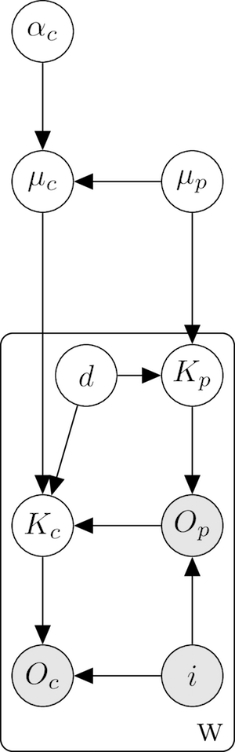

---
output:
  pdf_document: default
  html_document: default
---

# Practical Foundations {#intro}

<!-- The MB-CDI and the Wordbank Project -->

(Some material in this chapter comes from @frank2016 and @marchman2017)

The emergence of children's early language is one of the most miraculous parts of human development. The ability to communicate using language arrives with incredible rapidity -- most parents judge that their child is producing words with the intent to communicate before his or her first birthday [@schneider2015] and now several reports indicate that the onset of comprehension is even earlier [e.g., @bergelson2012,@tincoff1999]. Yet the path towards linguistic mastery is slow.

Almost uniquely in cognitive development, early language learning also offers an opportunity to study both consistency and variability in a single phenomenon. Often researchers interested in consistency have measured theoretically-important, carefully-chosen phenomena using small convenience samples that suffice to show a proof-of-concept but do not provide information about variability. In contrast, work on variability between individuals has often focused on larger samples with more reliable tasks, that -- perhaps as a consequence of their reliability -- are less tightly linked to a particular theoretical construct of interest. 

The nature and course of early word learning is an important window into children's growing understanding of the world. Early words cross-cut a variety of linguistic categories, but generally consist of names for caregivers (e.g., mama), common objects (e.g., bottle, shoe), social expressions (e.g., bye-bye), and actions or routines (e.g., peekaboo, throw) [@nelson1973;@tardif2008]. New words enter children's expressive vocabularies slowly at first, but this process accelerates over the second year such that children reach an average of 300 words by 24 months and more than 60,000 by the time they graduate from high school [@fenson2007]. At the same time, there are significant individual differences in the rate and timing of language acquisition. For example, according to detailed observational studies, although some 18-month-olds already produce 50--75 words, others produce no words at all, and will not do so until they are 22 months or older [e.g., @brown1973;@bloom2002;@clark2003]. Moreover, some children show increases in their rate of vocabulary growth well before the end of the 2nd year, others not until well after their 2nd birthday, and still others may not "spurt" at all [@fenson2007; @goldfield1990; @ganger2004]. How can such differences be measured accurately and efficiently? And can we promote early detection of differences in vocabulary growth that will be clinically significant later in development?

## Measuring early vocabulary

Traditional studies of language development typically apply a combination of observational assessment and structured tests, frequently relying on short samples of interactions and small samples of children. Discerning both the universal features and natural variation of early lexical development has been greatly facilitated by the development of parent report instruments like the MacArthur-Bates CDI [@fenson1994; @fenson2007] and the Language Development Survey [LDS; @rescorla1989]. The CDIs in particular were developed across a period of more than 40 years. Originally designed for use in a research study [@bates1976], the instruments have evolved from a structured interview to the current paper-and-pencil format and are now increasingly administered online [e.g., @kristoffersen2013] for Norwegian or \url{http://laboratorium.detskarec.sk} for Slovak). While other assessment tools exist for slightly older children, to our knowledge, no other measure allows cost-effective global language assessment for children in the critical age ranges between the emergence of language and the period when children become more able to engage in structured, face-to-face activities (around 30 months).

Naturalistic observations are the other leading candidate for measurement of early language, but such observations are extremely costly and time-consuming to transcribe and annotate. These difficulties lead to a tradeoff where most studies either include dense data about a small number of children or smaller amounts of data with a larger sample size. Dense datasets currently provide the best method for in-depth study of the interaction between learning mechanisms and language input in individuals [e.g., @lieven2009; @roy2015], although the generalizability of these studies is necessarily limited by their small sample sizes. At the other end of the spectrum, assessment of many individual language samples can yield information about individual variability [e.g., @dickinson2001; @cartmill2013; @weisleder2013], but at some cost in terms of depth.

In addition, naturalistic observations do not measure children's language comprehension, a variable of interest for many early language researchers. Estimates of production vocabulary from naturalistic observation are highly correlated with the CDI within studies [e.g., @bornstein1998], but are likely to be affected substantially by length of the session, context, and interlocutor when comparing across studies [see e.g., @hidaka2015 for discussion]. And although there exist methods to extract insights about global vocabulary from naturalistic observation, these statistical extrapolations are relatively new and have not been validated extensively [@hidaka2015]. Other comprehension vocabulary measures are also available across some range of languages [e.g., the Peabody Picture Vocabulary Test 4; @dunn2007], but these assessments are tailored for children older than 2 1/2 years.

## Logic of Parent Report

Parent-report instruments like the CDI and LDS take advantage of the fact that parents (or other primary caregivers) are expert observers of their child. Parent reports are based on experiences with the child which are not only more extensive than any researcher or clinician can obtain, but are more representative of the child's ability. Parents have experience with children at play, at meals, at bath and bedtime, at tantrums -- in short, with the full range of the child's life and therefore with the full range of language structures used in these contexts.  Parents also have had opportunities to hear the child interact with other people: the other parent, grandparents, siblings, and friends. Because responses on these instruments represent an aggregation over much time and many situations, they are less influenced by factors that can mask a child's true ability in the laboratory or clinic, such as shyness or compliance, or that can impact the validity of naturalistic sampling, such as word frequency. As @bates1991 point out, “parental report is likely to reflect what a child knows, whereas [a sample of] free speech reflects those forms that she is more likely to use.” (p. 57).

The application of parent report enables the collection of data from far larger samples of children than would be possible with standardized tests or naturalistic observation. Information from more adequate samples, especially in the form of norms, can benefit both clinical practice and research. @fenson1994, for example, used the norming data from the MacArthur-Bates Communicative Development Inventories (CDIs) - a sample of 2,550 children aged 8 to 30 months - to address questions about variability in communicative development. Large samples are especially needed to provide an accurate statistical description of extreme scores, i.e., what score corresponds to the 10th percentile? What does the most advanced child (e.g., > 90th percentile) look like at a given age?  Research on questions such as environmental influences on language development can also benefit from large samples. Correlational research is hampered by the problem of multicollinearity: The predictor variables such as parental education, number of books in the home, family size, use of questions vs. imperatives, are likely to be intercorrelated, making it difficult to separate the effects of each of them individually. Large samples in which there is a substantial amount of non-overlapping variance are essential for addressing these questions.

An additional advantage of the parent-report method is that parents can also report on many different sub-components and correlates of early vocabulary development. In particular, the CDI instruments ask about use of communicative gestures, grammar, and symbolic play, as well as vocabulary comprehension and production. Information about what early vocabulary development correlates with, and what it does not, can yield important theoretical information about the common mechanisms underlying learning.  As @bates1991 note, studies which have the power and scope to examine what "hangs together" across early language development can provide critical clues to how the system is put together in the first place (p. 7).

The main core of the CDIs is the vocabulary checklist. This list is essentially a 'bag of words' which represents the set of words that best capture variation in lexical development across the full spectrum of child ages and abilities.  Parents choose the words their child currently "understands" (comprehension, measured for younger children) or "says" (production, measured for both younger and older children).  The checklists contain words from many different semantic (e.g., animal names, household items) and syntactic (e.g., action words, connectives) categories, resulting in broader samples of lexical knowledge than are available from other methods. In their English and Spanish instantiations, the vocabulary checklists come in two versions: Words & Gestures (W&G) (8--18 months) which contains about 400 words, and the Words & Sentences (W&S) (16--30 months), which contains about 700 words. A child's score on a vocabulary checklist represents their comprehension or production "vocabulary size," indexing that child's relative status against other children assessed with the same list.

## Limitations of parent report

Although the standardization of parent reports using the CDI contributes to the availability of large amounts of data in a comparable format, there are significant limitations to the parent report methodology as well [@tomasello1994, @feldman2000]. Clearly there are legitimate concerns about the ability of parents to provide detailed and specific knowledge about their children's language. 

What does it mean when a parent reports that their child knows a word? In an ideal world, parental report would be an unbiased reflection of their observation of their child's language development: When asked if their child produces the word *dog*, a parent would try to recall situations in which their child has used the word *dog* correctly, and report the success or failure of this process of recollection. There are, however, a number of other sources of information that the parent might bring to bear. Figure \ref{fig:parent_model} uses graphical model notation to depict information that could be reflected in parent report [@jordan2004]. 

{width=20%}

The nodes in this model reflect variables of interest--shaded gray if they are observed, and hollow if they are latent variables that the parent does not have direct access. The edges in this graph represent statistical dependencies among these variables. For each word on the CDI, the parent is asked to report $O_{c}$: have they observed their child producing the word? This observed variable depends on a latent variable $K_{c}$: whether their child knows the meaning of this word. This knowledge in turn depends in three other variables: $O_{p}$ the parent's productions of this word in the past, $d$ the difficulty of learning this word, and $\mu_{c}$ the child's general linguistic ability. This general ability in turn depends on the parent's linguistic ability $\mu_{p}$ and age-related factors $\alpha_{c}$. In addition, the CDI does not ask about every word in the child's vocabulary, only items on the form $i$. Because all of these other variables are statistically related to the child's observed productions, parents could be be bringing any or all of them to bear in their responses. 

First, parents may be biased observers. Most parents do not have specialized training in language development, and may not be sensitive to subtle aspects of language structure and use. Further, a natural pride in the child and a failure to critically test their impressions may cause parents to overestimate the child's ability ($\mu_{c}$); conversely, frustration in the case of delayed language may lead to underestimates. Parent report is most likely to be accurate under three general conditions: (1) when assessment is limited to current behaviors, (2) when assessment is focused on emergent behaviors, and (3) when a primarily recognition format is used. Each of these conditions acts to reduce demands on the respondent's memory, for example, parents are better able to report on their child's language at the present than at times past and when their child is actively learning the particular words on the list (e.g., names for animals). 

Parent reports likely suffer from a number of biases that interact with sub-portions of the forms and the ages of the target children.  For example, it is likely that parents may have more difficulty reporting on children's comprehension or production of function words (e.g., so, then, if) than content words (e.g., baby, house)--relying more on their estimates of the words general difficulty ($d$). Moreover, in typically-developing samples, parents can track their child's receptive vocabulary to about 16-18 months, after which it is too large to monitor. Expressive vocabulary can be monitored until about 2½ - 3 years, after which the number of words a child can say becomes too large.The CDI instruments capitalize on the greater ease of recognition, as contrasted with recall, to help offset these memory limitations. That is, it is better to ask parents to report on their child's vocabulary by selecting words from a list of possible words rather than having them write down all the words they can recall hearing their child use (or, even worse, asking the global question: “Does your child know at least 50 words?"). In addition, asking parents to reflect on their child's language abilities may be particularly difficult for early comprehension. As @tomasello1994 point out, for the youngest children, especially 8-10 month olds, vocabulary comprehension scores can be surprisingly high and likely implausible, possibly reflecting a lack of clarity in what the term “understands” means for parents of children at this young age.

Third, there is some evidence that variability in reporting biases may be moderated by factors such as SES [@feldman2000; @fenson2000; @feldman2005]. Some studies suggest that parents from some SES groups may be more likely to underestimate child's abilities [@roberts1999], while others report that parents from lower-SES groups may over-estimate children's abilities, especially comprehension at younger ages [@goldfield1990; @feldman2000). Later studies have shown that, for children over 2 years, patterns of validity were consistent in lower and higher-SES groups [@feldman2005; @reese2000]. Thus, SES-differences could reflect valid delays in children’s language development that parallel those obtained with different methods, such as naturalistic observation or standardized tests (e.g., @hammer2010). A unique and important extension of this work for Wordbank is to examine the consistency of SES differences across a large number of languages and hence, language communities which may vary in the social impact of SES gradients.

Fourth, the items on the original CDI instruments were chosen to be a representative sample of vocabulary for the appropriate age and language [@fenson1994]. The checklists contain some words that most, including the youngest, children are able to understand or produce, some words that are understood or produced by the "average" child, and some which only children who are relatively more advanced will understand or produce.  This structure ensures that the list has the psychometric property of capturing individual differences in vocabulary both across younger and older children and across children of different developmental levels. Validity of the CDIs has been demonstrated in reference to both standardized tests and naturalistic language sampling (see Chapter 4 of @fenson2007). Note that the checklists were not originally constructed with the intention that responses on individual items would be reliable.  While item level responses provide useful information about patterns across children are likely to understand or produce, responses on the vocabulary checklist do not necessarily license the conclusion that a child would respond appropriately when asked "can you say ____?" by an experimenter in a confrontation naming task. Nonetheless, if parents' observations at the item level reflect any signal--even in the context of significant influence from other factors--then this signal should be observable by aggregating together data from many children.

Fifth, while the lengths of the vocabulary checklists on the CDIs may give the impression that they yield an estimate of the child's full vocabulary, in fact the vocabulary size estimates only reflect a child's relative standing compared to other children assessed with the same list of words[$i$, see @mayor2011 for discussion]. Such estimates should not be misconstrued as a comprehensive estimate of the child's vocabulary knowledge, as CDI scores likely understate the size of a child's "true" vocabulary substantially, especially for older children [@mayor2011]. Moreover, while it is tempting to ask parents to indicate additional words that their child might be able to understand or say, users should be aware that including those items introduces bias in the estimates.

In sum, despite these limitations, when used appropriately, the CDI instruments yield reliable and valid estimates of total vocabulary size. Because the instruments were designed to minimize bias by targeting current behaviors and asking parents about highly salient features of their child's abilities, they have proven to be an important tool in the field, dozens of studies demonstrating concurrent and predictive relations with naturalistic and observational measures, in both typically-developing and at-risk populations [e.g., @dale1996; @thal2000; @marchman2002]. In addition, a variety of recent work has shown that individual item-level responses can yield exciting new insights, for example about the growth patterns of semantic networks when aggregated across children [@hills2009; @hills2010].  Such analyses have the potential to be even more powerful when applied to larger samples and across languages as they are within Wordbank.

## Adaptations, not translations!

Originally designed for English, parallel CDI instruments have now been adapted for more than 90 languages (http://mb-cdi.stanford.edu/adaptations.html), with data from 25 of those languages currently available in Wordbank. The ethic behind the development of these instruments is "adaptation, not translation" -- in other words, to create forms with the same spirit as the English form, but not to simply translate the items. Instead, developers have been strongly encouraged to craft instruments that reflect the linguistic and cultural contexts that influence the early acquisition of vocabulary and other aspects of language in that particular language.  While many words on the English-language checklist may easily translate to other languages, others will simply not be relevant within the same developmental time frame for children learning that new language, e.g., ‘cheese’ in Japanese or ‘snow’ in Arabic.  Conversely, additional words may be needed in the new language which were not included on the English-language vocabulary checklist, e.g., ‘tortilla’ in Mexican Spanish.  

In all languages, the vocabulary checklists include words that appear earlier and later in normal development, as well as a similar proportion of words from different lexical classes, for example, nouns, verbs, adjectives, and so on. Taken individually then, each adapted instrument captures key trends in vocabulary development aggregated across all items on the respective checklists.  Wordbank's tools allow users to plot trends over age to model general developmental trends within that language, including median-level growth and estimates of the variation across individuals.  Because data are also available at the item-level, Wordbank also allows analyses of developmental trajectories of individual items within each of the languages represented.  IS THIS WHAT WE WANT TO DO HERE, i.e., DIRECT READERS TO WHERE ON THE WORDBANK SITE THEY COULD CONDUCT SUCH ANALYSES?

Importantly, the breadth of the data in Wordbank enables many different cross-linguistic comparisons of vocabulary development.  For example, by comparing proportions of words understood or produced across age, Wordbank can document the cross-language consistency in individual variability in rate of development (\@ref(norms)) (NOT SURE IF WE DO THIS), gender differences (\@ref(XXX)), dissociations between comprehension and production (IS THIS INCLUDED?), early biases towards nouns over predicates and function words (\@ref(XXX)), relations between early communicative gestures and later receptive vocabulary (\@ref(gestures)), and close ties between vocabulary and grammar (\@ref(grammar)). 

Other analyses in Wordbank rely on translation equivalents being derived for individual checklist items. (See XXX for more information about the procedures implemented in Wordbank to create these translation equivalents.) OR DO WE WANT TO PUT MORE DETAIL HERE? Because the language lists were crafted specifically for each language by the individual developers, cross-language comparisons involve only the sub-set of items that are common across the different languages.  Moreover, the set of available items may differ depending on the particular analysis.  For example, in the case of GENDER? (\@ref(XXX)), only XX number of items have translation equivalents in a sufficient number of languages to enable comparison. Finally, even with the care used here to construct a robust set translation equivalents, individual items are likely to only be roughly equivalent crosslinguistically, and may have significantly different referential scopes for children learning the different languages.  That is, if a parent indicates that a child can produce the word "dog" in English and another parent indicates the translation equivalent in, for example, Spanish ("perro"), it may nevertheless be the case that these words are heard more or less frequently and in different contexts in the two languages.  An important empirical question is the degree to which translation equivalents across languages have consistent developmental profiles.  DO WE HAVE ANY ANALYSES THAT ESTIMATE THE CONSISTENCY OF AGE OF ACQUISITION ACROSS LANGUAGES, NOT JUST IN THE PREDICTORS?

Finally, due to variation in language structure and the interests of the developers of CDI adaptations, the CDI instruments vary in structure across languages. Most adaptations of the W&G generally include gestures as well as vocabulary comprehension and production, however, it is not always the case (e.g., XXX).  Further, while adaptations of the W&S always include vocabulary production, not all instruments also contain some measures of grammar, for example, early use of closed-class morphology or combinatorial syntax (e.g., XXX). Note that linguistic differences render the structure and format of many parts of the grammar sections to be very different, and hence, not amenable to comparisons across languages. 

While there are inherent limitations in comparing different instruments across languages, Wordbank is the first package of computational tools that allows the exploration of both child- and item-level data within- and across such a large and diverse set of languages.  As such, the availability of these adaptations remain at the core of the analyses that we offer within Wordbank.  MORE HERE?

IS ANYTHING MISSING IN THE ABOVE?  Need to add sections/material on:
+ Limitations on cross-population comparison
+ Limitations on cross-linguistic comparison

## Wordbank

To take advantage of the opportunity posed by the broad use of CDI instruments in the child language community, in 2014 we began constructing Wordbank, an open repository for CDI data that allows for interactive analysis and visualization. Our inspiration for Wordbank came from two successful projects for sharing data on children's language acquisition. The first is the Child Language Data Exchange System [CHILDES; @macwhinney2000]. A database of transcripts of children's speech and speech to children, CHILDES has grown into a robust and important tool for the community, with many contributors and affiliated projects. The second is the Cross-Linguistic Lexical Norms site [CLEX; \url{www.cdi-clex.org}; @jorgensen2010}], which is closer in content to Wordbank, and effectively our precursor. CLEX archives normative data from a range of CDI adaptations across languages, allowing browsing of acquisition trajectories for individual items or age groups.

Wordbank builds on CLEX, offering the same functionality but allowing flexible and interactive visualization and analysis, as well as direct database access and data download. In addition, Wordbank's goal was always to extend beyond normative data by dynamically incorporating data from many different researchers and projects of varying sizes and scopes.  While the resulting datasets in Wordbank are much more heterogeneous than norming data, they are also larger and more representative than the individual norming datasets (in some cases), and available in languages where no norms exist (for others).  

