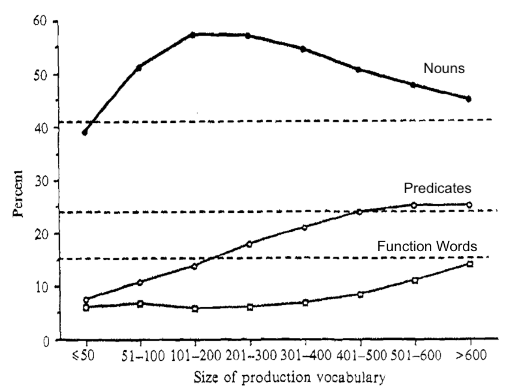
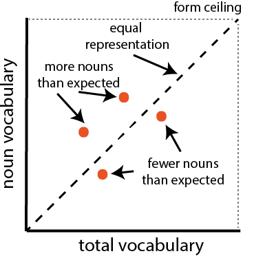

# Vocabulary Composition: Syntactic Categories {#categories-syntactic}

Note:
  ~ *An earlier version of this work was presented at the Boston University Conference on Language Development in 2015.*

We have previously examined vocabulary with a wide angle lens, focusing on total vocabulary size (Chapter \@ref(vocabulary)), as well as with a narrower lens, examining individual words (Chapter \@ref(items-prediction)). Here we take a middle perspective, splitting vocabulary by syntactic category and analyzing consistency and variability across languages in the acquisition of these categories. A primary goal of this analysis is to quantify the “noun bias” across languages. In addition, we quantify the degree of bias for or against verbs and closed-class words. This chapter deals primarily with the aggregate biases for or against syntactic categories across entire datasets, but in Chapter \@ref(style), we consider variation of this sort within individuals.

## Introduction

### The composition of early vocabulary

As we reviewed in Chapter \@ref(items-consistency), the first words children utter are quite consistent and primarily composed of names for people and things and words related to social routines [see also @tardif2008;@schneider2015]. Soon after, however, they begin to add predicates, such as verbs (_go_) and adjectives (_pretty_), in greater proportions than earlier in development and may even begin to use closed-class forms, such as determiners (_the_). These patterns seem to suggest a developmental course that follows distinct "waves" of learning for words from different classes. That is, along with early social routines, nouns tend to predominate early vocabularies, while other types of words, such as predicates and closed class forms, are learned later. This pattern may be further qualified by differences in the types of words learned in comprehension vs. production [@benedict1979].   

Examination of the composition of early vocabulary is complicated by the fact that we categorize words by their adult syntactic category. We do so in the discussion below without presupposing that children themselves do this categorization, however [@tomasello2000]. Children may be sensitive to these categories very early in development [@valian1986;@yang2013] or they may discover them either gradually [@pine1997] or more quickly [@meylan2017]. Importantly, though, we treat adult syntactic categories as an analytic convenience that describes certain regularities in how groups of words are distributed in the talk by adults (as captured, for example, in language samples) and how they function in different contexts, rather than as an ontological fact about children's knowledge.

```{r catsyn-bates, out.width="80%", fig.cap="Figure 1 from Bates et al. (1994), showing developmental trends in the categorical composition of early vocabulary as number of items. Horizontal lines represent the number of opportunities on the vocabulary checklist for each category."}

```

@bates1994 characterized these patterns of vocabulary composition in the following way. Figure \@ref(fig:catsyn-bates) (reprinted from that paper) shows average vocabulary composition of nominals, predicates and closed class forms as a function of children's vocabulary size for English-speaking children from the original CDI WS norming study [@fenson1994]. Note that when children only know a few words (e.g., fewer than 50), nominals comprise the greatest proportion of the words that children are reported to produce, with very few predicates or closed class forms (<10%). As the children learn the next hundred words or so, the proportion of nominals increases even more dramatically with a gradual increase in the proportion of children's vocabularies that are predicates. Closed class forms remain a much smaller proportion over this period. Yet, after about 300 words, children do not appear to add nouns to their vocabularies at the same pace that they did earlier in development; consequently, the proportion of nominals tends to decrease.^[This effect may also reflect aspects of CDI form design, e.g. "running out of nouns" to learn: children may increasingly be learning nouns that are not on the forms.] During this developmental period, the proportion of predicates in the vocabulary tends to increase, followed by growth in the proportion of closed class forms. 

A different way to capture these same trends is shown in Figure \@ref(fig:catsyn-prop) [also reprinted from @bates1994]. Here, each of the categories of words is plotted as a proportion of the opportunities on the checklist, again as a function of total vocabulary size. Shown in this way, the curves reflect when in development children are reported to produce half of the words in each of the categories, as represented by the solid horizontal line.  For example, it is easy to see that 50% of the nouns have been checked (on average) when total vocabulary is between 200 to 300 words, whereas, 50% of the predicates are reported (on average) when overall vocabulary size falls between 300 and 450 words.  Finally, closed-class opportunities do not reach the 50% mark until total vocabulary falls between 500 and 600 words.

```{r catsyn-prop, out.width="80%", fig.cap="Figure 3 adapted from Bates et al. (1994), showing developmental trends in the categorical composition of early vocabulary, using proportions of total opportunities in each category. Horizontal line represents the point at which 50\\% of the items are chosen on average for each category."}
include_graphics("images/bates1994_2_key.png")
```

### The noun bias 

Why do children learn nouns before verbs and other types of words? This question has received a great deal of attention in the literature; we briefly summarize some of the major issues here. Before doing so, we note that @bates1994 consider the contrast between nouns and predicates, while other literature considers verbs specifically rather than grouping predicates together [e.g., @gentner1982]. In the analysis below, we split the difference by beginning with predicates (to increase the amount of data we consider) and later breaking down that category into verbs and adjectives. 

One reason for the widely-reported "noun bias" (over-representation compared with verbs and predicates more generally) could be that nouns are simply more frequent in the talk to young children. It is well-established that children learn the words that they hear more often [e.g., @hart1995]. Many observational studies of English-speaking caregivers have demonstrated that caregivers use more nouns than verbs (in both types and tokens) with their children [e.g., @fernald1993; @goldfield1993; @gopnik1996; @kim2000; @poulindubois1995; @tardif1997]. @gentner1982 considered and rejected this explanation, however: Predicates and function words are often *more* frequent than nouns, not less, thus pure frequency is not a sufficient explanation of the phenomenon. We investigated the role of word frequency in more detail in Chapter \@ref(items-prediction); our findings are consistent with Gentner's. 

Other researchers have framed the "noun bias" in terms of universals about what and how different words "partition" things (e.g., objects, people, relations, qualities, etc.) in the world. For example, @gentner1982 argued that children learn nouns before verbs because the meanings of nouns are easier to encode since they identify things that can be more easily differentiated in the world (e.g., common everyday objects). Verbs and other predicates, in contrast, express *relations* among things in the world. Hence, the meanings of verbs are less accessible to children through common, everyday experiences and thus, are more difficult to map onto word forms without additional linguistic or social support. In addition, verbs and predicates may be more likely to vary in their precise meaning across languages. 

<!-- With respect to word order, verbs might be predicted to be less salient in subject-verb-object (SVO) languages than subject-object-verb (SOV) languages. Gentner found no evidence for differences in noun bias by word order, however.  -->

Another reason that nouns might be easier than verbs for young children is that nouns tend to be less morphologically complex than verbs [e.g., @tardif1997]. For example, in many languages, nouns are typically marked for number, case, and gender, while verbs are likely to additionally carry tense information. In English, at least, verbs might also be harder to learn because they tend to occur in sentence-medial position (rather than sentence final), which make verbs less salient in the input that children hear [@slobin1985; @caselli1995].

Finally, differences in children's acquisition of nouns vs. verbs might result from differences in the contexts in which children hear nouns vs. verbs in the speech from caregivers [e.g., @choi1995; @tardif1999]. Several researchers have examined what caregivers talk about using naturalistic data of caregiver-child interactions. For example, caregivers in some cultures tend to emphasize the names for people or things in the world, spending a great deal of time providing labels and "names for things" for their children. In other cultures, caregivers do so much less frequently, instead focusing on the actions in which those objects or people engage [e.g., @fernald1993; @gopnik1996]. These differences in input to children could influence which words are salient for children, and hence, which words they are most likely to learn.

What is the evidence that a noun bias is a universal feature of children's vocabularies? Documenting the extent to which the noun bias is universal is relevant to understanding mechanisms of language learning, in particular, the presence of conceptual biases in early acquisition and the role of cross-cultural variability in the input that children receive from caregivers. Some studies find consistent evidence for a noun bias in English, as well as in Korean and Italian [@bates1994; @au1994; @caselli1995; @kim2000]. The literature is mixed, however, and other studies do not find evidence of a noun bias in languages as varied as French, German, Chinese, Estonian, and Korean [@bassano2000; @bloom1993; @choi1995; @kauschke2002; @tardif1996; @tardif1999; @schults2016]. 

<!-- Cross-linguistic variation suggests that the words that young children learn is less a function of universal conceptual biases and more likely due to structural features of the language and characteristics of the input that children receive when engaging with caregivers.  -->
Identifying the extent of cross-linguistic variation vs. universals with respect to the noun bias has been difficult, however, since variation across studies may be due to the different methodologies that are used. Even within a single language -- Korean -- parent reports of children's first words find a noun bias [e.g., @au1994], whereas studies using direct observational methods find less evidence for this pattern [e.g., @gopnik1996]. Few studies have had the scope to directly compare the extent of the noun bias across multiple languages using a common methodology. 

One notable exception in a literature where samples have been small -- in terms of both languages and children -- is @bornstein2004, in which the researchers compared vocabulary composition in seven languages. In this chapter, we follow their comparative approach [see also @tardif2008]. Since we have access to many more observations, our approach offers a more comprehensive approach than these earlier studies. Moreover, we attempt to quantify the estimates of the extent to which languages show a noun bias: we develop a statistical method for quantifying the extent of the noun bias across the entire developmental range in which a particular form is used. 

## Methods and data

Each CDI form contains a range of words from different syntactic categories. As in Chapter \@ref(items-prediction), we adopt the categorization of @bates1994, categorizing words into nouns; predicates (verbs, adjectives, and adverbs); and function words (also referred to as "closed class" words). For each child's vocabulary, we compute the proportion of the words in each of these categories that they are reported to produce. Following the approach developed by @bates1994, for each of the languages in our sample, we plot these proportions against total vocabulary. We use a style similar to Figure \@ref(fig:catsyn-prop), with some modifications; our version of this plot is shown schematically in Figure \@ref(fig:catsyn-schematic). Taking nouns as our example, if a child learns words irrespective of syntactic category, then the proportion of nouns in the child's vocabulary should be the same on average as the proportion of total vocabulary that the child knows (the diagonal). In contrast, if the child learns more nouns than expected, their datapoint would be above the diagonal; if they learn fewer, their datapoint would fall below the diagonal. By averaging these datapoints, we can then assess the average bias for or against nouns (and other categories as well). 

```{r catsyn-schematic, out.width="60%", fig.cap="Schematic of our vocabulary composition analysis."}

```

In this chapter, we limit our analysis to traditional WS and WG forms (along with variants in these classes) because short forms, like the one used in the British English TEDS study, do not typically include category information. We also exclude longitudinal administrations so as not to over-weight particular children in our estimates of the extent of category biases in the population.

<!-- The sample sizes included in this analysis are given in Table \@ref(tab:catsyn-sample-sizes). -->

```{r catsyn-items}
items <- items %>%
  filter(type == "word") %>%
  mutate(num_item_id = as.numeric(substr(item_id, 6, nchar(item_id))))
```

```{r catsyn-vocab_comp_fun}
get_vocab_data <- function(input_language, input_form) {
  print(paste(input_language, input_form))
  
  lang_vocab_items <- items %>%
    filter(language == input_language, form == input_form,
           lexical_category %in% c("nouns", "predicates", "function_words"))
  
  get_instrument_data(language = input_language,
                      form = input_form,
                      items = lang_vocab_items$item_id, 
                      iteminfo = lang_vocab_items) %>%
    mutate(value = ifelse(is.na(value), "", value),
           produces = value == "produces",
           understands = value == "produces" | value == "understands") %>%
    select(-value) %>%
    gather(measure, value, produces, understands) %>%
    mutate(num_words = nrow(lang_vocab_items),
           language = input_language, form = input_form) %>%
    filter(form %in% WGs | measure == "produces")
}

get_vocab_comp <- function(lang_vocab_data, group) {
  group <- rlang::enquo(group)
  
  num_words <- n_distinct(lang_vocab_data$item_id)
  lang_vocab_summary <- lang_vocab_data %>%
    group_by(data_id, measure, !!group) %>%
    summarise(num_true = sum(value),
              total = n(),
              prop = num_true / total)
  
  lang_vocab_sizes <- lang_vocab_summary %>%
    group_by(data_id, measure) %>%
    summarise(vocab_num = sum(num_true),
              vocab = vocab_num / num_words)
  
  lang_vocab_summary %>%
    left_join(lang_vocab_sizes) %>%
    mutate(prop_vocab = num_true / vocab_num) %>%
    select(-num_true)

}
```

```{r catsyn-vocab_comp, eval=FALSE}
instruments_inc <- instruments %>%
  filter(form %in% c(WSs, WGs)) %>%
  select(language, form) %>%
  distinct()

vocab_data <- instruments_inc %>%
  mutate(inst_vocab_data = map2(language, form, get_vocab_data))

vocab_comp_category <- vocab_data %>%
  mutate(vocab_comp = map(inst_vocab_data, ~get_vocab_comp(., lexical_category)))
vocab_comp_class <- vocab_data %>%
  mutate(vocab_comp = map(inst_vocab_data, ~get_vocab_comp(., lexical_class)))
  
asl <- "American Sign Language"
asl_form <- "asl_combined"
asl_forms <- instruments %>% filter(language == asl) %>% pull(form)
asl_vocab_data <- map_df(asl_forms, ~get_vocab_data(asl, .)) %>%
  mutate(form = asl_form) %>%
  group_by(language, form) %>%
  nest(.key = "inst_vocab_data")

asl_vocab_comp_category <- asl_vocab_data %>%
  mutate(vocab_comp = map(inst_vocab_data, ~get_vocab_comp(., lexical_category)))
asl_vocab_comp_class <- asl_vocab_data %>%
  mutate(vocab_comp = map(inst_vocab_data, ~get_vocab_comp(., lexical_class)))
# WGs <- c(WGs, asl_form)

vocab_comp_category <- vocab_comp_category %>% bind_rows(asl_vocab_comp_category)
vocab_comp_class <- vocab_comp_class %>% bind_rows(asl_vocab_comp_class)

vocab_comp_data <- vocab_comp_category %>%
  select(-inst_vocab_data) %>%
  unnest()

class_data <- vocab_comp_class %>%
  select(-inst_vocab_data) %>%
  unnest()
```

```{r catsyn-exclude-longs, eval=FALSE}
# take earliest administration for any child with multiple administrations
first_longitudinals <- admins %>%
  filter(longitudinal) %>%
  group_by(source_name, original_id) %>%
  arrange(age) %>%
  slice(1)

cross_sectionals <- admins %>%
  filter(!longitudinal | data_id %in% first_longitudinals$data_id)

vocab_comp_data <- vocab_comp_data %>% filter(data_id %in% cross_sectionals$data_id)
class_data <- class_data %>% filter(data_id %in% cross_sectionals$data_id)

write_feather(vocab_comp_data, "data/categories-syntactic/vocab_comp_data.feather")
write_feather(class_data, "data/categories-syntactic/class_data.feather")
```

```{r catsyn-sample-sizes}
WGs <- c(WGs, "asl_combined")
forms <- bind_rows(
  as_tibble(WSs) %>% rename(form = value) %>% mutate(form_type = "WSs"),
  as_tibble(WGs) %>% rename(form = value) %>% mutate(form_type = "WGs")
)

vocab_comp_data <- read_feather("data/categories-syntactic/vocab_comp_data.feather") %>%
  mutate(lexical_category = lexical_category %>%
           fct_relevel(c("nouns", "predicates", "function_words")) %>%
           fct_recode("Nouns" = "nouns", "Predicates" = "predicates",
                      "Function words" = "function_words"),
         measure = fct_relevel(measure, "understands")) %>%
  left_join(forms) %>%
  group_by(language, form_type) %>%
  mutate(num_forms = n_distinct(form),
         langform = if_else(num_forms > 1,
                            paste(language, form, sep = .inst_sep), language))
```

```{r catsyn-plot-area-demo, fig.cap="For American English WS data, proportion of each lexical category produced by each child as a function of the proportion of all vocabulary items produced by that child. Lines show model fits.", fig.height=3}
demo_lang <- "English (American)"
demo_form <- "WS"
demo_data <- vocab_comp_data %>% filter(language == demo_lang, form == demo_form)

pts <- seq(0, 1, 0.01)

demo_predictions <- demo_data %>%
  group_by(lexical_category) %>%
  nest() %>%
  mutate(model = map(data, ~clm(prop ~ I(vocab ^ 3) + I(vocab ^ 2) + vocab - 1, data = .)),
         predictions = map(model, ~broom::augment(., newdata = tibble(vocab = pts)))) %>%
  select(lexical_category, predictions) %>%
  unnest() %>%
  rename(prop = .fitted)

demo_diagonal <- cross_df(list(vocab = rev(pts),
                               lexical_category = unique(demo_data$lexical_category))) %>%
  mutate(prop = vocab)

demo_area_poly <- bind_rows(demo_predictions, demo_diagonal)

vocab_scale <- scale_x_continuous(limits = c(0, 1), expand = c(0.01, 0),
                                  breaks = c(0, 0.5, 1), labels = c(0, 0.5, 1),
                                  name = "Vocabulary size")
prop_scale <- scale_y_continuous(limits = c(0, 1), expand = c(0.01, 0),
                                 breaks = c(0, 0.5, 1), labels = c(0, 0.5, 1),
                                 name = "Proportion of category")

ggplot(demo_predictions, aes(x = vocab, y = prop, colour = lexical_category)) +
  facet_grid(. ~ lexical_category) +
  coord_fixed() +
  geom_point(data = demo_data, alpha = .03, size = 0.6) +
  geom_line(size = 1.5) +
  geom_polygon(data = demo_area_poly, aes(fill = lexical_category), alpha = 0.2) +
  vocab_scale +
  prop_scale +
  .scale_colour_discrete(guide = FALSE) +
  .scale_fill_discrete(guide = FALSE)
```

Figure \@ref(fig:catsyn-plot-area-demo) shows this analysis for the American English WS data. Each point shows an individual child's vocabulary, and each panel shows a different lexical class (thus each child is represented once in each panel). The curves show the relationship between a class and the whole vocabulary. We capture the overall trend in this plot by estimating a generalized linear model over the data, predicting category proportion as a function of total production (shown by the thick lines). This model is fit with third-order polynomials (to allow both concave and convex functions, and changes in convexity). We fit these models with the constraint that they must predict the point (_x_ = 1, _y_ = 1), so that they are guaranteed to arrive at the diagonal point in the special case that all words on a form are checked.^[We experimented with a number of model classes and found that these polynomial models seemed flexible enough to provide good fit to a wide variety of patterns of data. Because our concern is not making statistical inferences about the shape of these curves (but rather estimating the area under them) we are not specifically worried about overfitting.]

```{r catsyn-resample}
poly_area <- function(group_data) {
  model <- tryCatch(
    clm(prop ~ I(vocab ^ 3) + I(vocab ^ 2) + vocab - 1, data = group_data),
    error = function(e) return(NA)
  )
  if (is.na(model)) return(NA)
  return((model$solution %*% c(1/4, 1/3, 1/2) - 0.5)[1])
}

sample_areas <- function(vocab_data, group, nboot = 1000) {
  
  group <- rlang::enquo(group)
  
  sample_area <- function(i) {
    print(i)
    vocab_data %>%
      group_by(language, form, measure) %>%
      sample_frac(replace = TRUE) %>%
      group_by(language, form, measure, !!group) %>%
      nest() %>%
      mutate(area = map_dbl(data, poly_area),
             sample = i) %>%
      select(-data)
  }
  
  map_df(1:nboot, sample_area)
}
```

```{r catsyn-areas_compute, eval=FALSE}
areas <- sample_areas(vocab_comp_data, group = lexical_category)
write_feather(areas, "data/categories-syntactic/vocab_comp_areas.feather")

class_areas <- sample_areas(class_data, group = lexical_class)
write_feather(class_areas, "data/categories-syntactic/class_areas.feather")
```

```{r catsyn-areas_read}
areas <- read_feather("data/categories-syntactic/vocab_comp_areas.feather")
class_areas <- read_feather("data/categories-syntactic/class_areas.feather")
```

```{r catsyn-area_summary}
area_summary <- areas %>%
  filter(!is.na(area)) %>%
  group_by(language, form, measure, lexical_category) %>%
  summarise(mean = mean(area),
            ci_lower = ci_lower(area),
            ci_upper = ci_upper(area)) %>%
  left_join(forms) %>%
  group_by(language, form_type) %>%
  mutate(num_forms = n_distinct(form),
         langform = if_else(num_forms > 1,
                            paste(language, form, sep = .inst_sep), language)) %>%
  ungroup()

pred_classes <- items %>%
  filter(lexical_category == "predicates") %>%
  pull(lexical_class) %>%
  unique()

pred_area_summary <- class_areas %>%
  filter(!is.na(area)) %>%
  filter(lexical_class %in% pred_classes) %>%
  group_by(language, form, measure, lexical_class) %>%
  summarise(mean = mean(area),
            ci_lower = ci_lower(area),
            ci_upper = ci_upper(area)) %>%
  left_join(forms) %>%
  group_by(language, form_type) %>%
  mutate(num_forms = n_distinct(form),
         langform = if_else(num_forms > 1,
                            paste(language, form, sep = .inst_sep), language)) %>%
  ungroup()
```

The final step in our method is to capture the overall bias in a particular sample by estimating the difference in area between the curve and the diagonal. If the curve is substantially above the diagonal, this difference will be positive (indicating e.g., a positive noun bias). In contrast, if the curve is below the diagonal, the difference will be negative. To capture uncertainty in this area estimate, we conduct a resampling analysis where we randomly resample each population of children 1000 times with replacement, then recompute the area measurement. Confidence intervals displayed below are based on this resampling procedure.

Critically, this analysis controls for a number of confounds in previous analyses. First, because our interest is in the shape of the overall curve, under-representation of children in some age-band should add uncertainty but not bias. Of course, if data are too sparse, estimates will be unconstrained (visible in wide confidence intervals), but particulars of age sampling should not bias our estimates. Second, in principle, the analysis should not be biased by the number of items in a particular category, as the analysis is relative to the numerical representation of a particular class on the form. Thus we should be able to compare across forms with larger or smaller numbers of items in particular sections.

## Results

We present results of this analysis across languages, beginning with comprehension for WG-type forms and moving to production for WS-type forms. We do not analyze WG production data here, however. For the most part, production estimates on WG forms are quite low, and hence curves are relatively unconstrained (or determined by a small number of children who are reported to have very large early vocabulary sizes). 

```{r catsyn-base-plot}
lexcat_colours <- set_names(.pal()(3), levels(vocab_comp_data$lexical_category))

base_plot <- function(input_forms, input_measure) {
  vocab_comp_data %>%
    filter(form %in% input_forms, measure == input_measure) %>%
    ggplot(aes(x = vocab, y = prop, colour = lexical_category)) +
      facet_wrap(~langform) +
      coord_fixed() +
      vocab_scale +
      prop_scale +
      scale_colour_manual(values = lexcat_colours, name = "") +
      theme(legend.position = "top",
            legend.key = element_blank(),
            legend.background = element_rect(fill = "transparent"), 
            strip.text.x = element_text(size = 7))
}
```

### Comprehension (WG)

```{r catsyn-plot-points-wg-comp, fig.asp=1.3, fig.cap="For each language's comprehension data, proportion of each lexical category produced by each child as a function of the proportion of all vocabulary items produced by that child. Lines show model fits.", dependson="catsyn-base-plot"}
base_plot(WGs, "understands") +
  geom_abline(slope = 1, intercept = 0, colour = .grey, linetype = .refline) +
  geom_jitter(size = .6, alpha = .1) +
  geom_smooth(method = "clm", formula = y ~ I(x ^ 3) + I(x ^ 2) + x - 1,
              size = 1, se = FALSE)
```

Comprehension results are shown in Figure \@ref(fig:catsyn-plot-points-wg-comp). This representation of the data is the most complete, but it can be somewhat overwhelming. The largest trend visible in these plots is the highly-consistent under-representation of function words. In contrast, though most theoretical discussion has centered on nouns and predicates, these two categories appear quite close to one another in most languages. For further detailed comparison, we show summaries of curve areas for each language in Figure \@ref(fig:catsyn-plot-areas-wg).

```{r catsyn-plot-areas-wg, fig.cap="Relative representation in vocabulary compared to chance for nouns and predicates for comprehension data in each language (line ranges indicate bootstrapped 95\\% confidence intervals)."}
plot_areas_wg <- area_summary %>%
  filter(form %in% WGs, measure == "understands") %>%
  arrange(lexical_category, mean) %>%
  mutate(order = factor(row_number()))

plot_areas <- function(area_data, measure) {
  ggplot(area_data, aes(y = order, x = mean, colour = lexical_category)) +
    ggstance::geom_pointrangeh(aes(xmin = ci_lower, xmax = ci_upper)) +
    facet_wrap(~lexical_category, scales = "free_y", drop = TRUE) +
    geom_vline(xintercept = 0, linetype = .refline, colour = .grey) +
    scale_colour_manual(values = lexcat_colours, guide = FALSE) +
    scale_y_discrete(breaks = area_data$order,
                     labels = area_data$langform) +
    labs(x = glue("Relative representation ({measure})"), y = "") +
    theme(panel.grid.major.y = .coef_line,
          axis.text.y = element_text(size = rel(0.8)))
}

plot_areas_wg %>%
  filter(lexical_category != "Function words") %>%
  plot_areas("comprehension")

plot_areas_wg_cats <- plot_areas_wg %>%
  filter(lexical_category != "Function words") %>%
  select(language, form, lexical_category, mean) %>%
  pivot_wider(names_from = lexical_category, values_from = mean)

npcor_wg <- cor.test(plot_areas_wg_cats$Nouns, plot_areas_wg_cats$Predicates)
```

Nouns are over-represented in many -- but not all -- languages. Mandarin, Slovak, Turkish, Portuguese, and Korean, a set of typologically- and culturally-distinct languages, show slight under-representation, with British Sign Language and British English showing the largest over-representation of nouns. Predicates are under-represented in some datasets and over-represented in others. Even datasets that are very closely related (e.g., Taiwanese Mandarin and Beijing Mandarin) show substantial differences in the degree of predicate bias. Confirming the visual impression of a tradeoff between nouns and predicates, there is a very strong negative correlation between noun and predicate bias measures (_r_(`r npcor_wg$parameter`) = `r roundp(npcor_wg$estimate)`); this correlation should be interpreted with some caution as nouns + predicates + function words are constrained to sum to 1, so some degree of correlation is assured.

```{r catsyn-function-words-comp, fig.cap="Relative representation in vocabulary compared to chance for function words for comprehension data in each language (line ranges indicate bootstrapped 95\\% confidence intervals)."}
 plot_areas_wg %>%
  filter(lexical_category == "Function words") %>%
  plot_areas("comprehension")
```

Function words are substantially under-represented across nearly every language and dataset in our sample (except Slovak). The scale difference on this plot should also be noted -- function-word bias values are far more extreme than noun and predicate bias values. These results likely reflect some combination of true under-representation of function-words as well as the difficulty of reporting on function-word comprehension in very early language (see Chapter \@ref(psychometrics) for more details on this issue). Such issues may also vary across cultures, languages, and administration methods. Function-word representation might plausibly differ due to linguistic factors such as morphological complexity, pronoun dropping, agreement, etc. However, it is also notable that the two lowest function-word scores come from Kiswahili and Kigiriama [@alcock2015], a study in which the predominantly rural, low-education parents may have had substantially less meta-linguistic awareness. 

### Production (WS)

```{r catsyn-plot-points-ws, fig.asp=1.1, fig.cap="For each language's production data, proportion of each lexical category produced by each child as a function of the proportion of all vocabulary items produced by that child. Lines show model fits.", dependson="catsyn-base-plot"}
base_plot(WSs, "produces") +
  geom_abline(slope = 1, intercept = 0, colour = .grey, linetype = .refline) +
  geom_jitter(size = .6, alpha = .1) +
  geom_smooth(method = "clm", formula = y ~ I(x ^ 3) + I(x ^ 2) + x - 1,
              size = 1, se = FALSE)
```

We next turn to production data from WS-type forms (Figure \@ref(fig:catsyn-plot-points-ws)). We can immediately see the same trend in the under-representation of function words as we observed in comprehension. In addition, however, in many but not all languages, a noun bias is more evident than it was in comprehension.

```{r catsyn-plot-areas-ws, fig.cap="Relative representation in vocabulary compared to chance for nouns and predicates for production data in each language (line ranges indicate bootstrapped 95\\% confidence intervals)."}
plot_areas_ws <- area_summary %>%
  filter(form %in% WSs, measure == "produces") %>%
  arrange(lexical_category, mean) %>%
  mutate(order = factor(row_number()))

plot_areas_ws %>%
  filter(lexical_category != "Function words") %>%
  plot_areas("production")

plot_areas_ws_cats <- plot_areas_ws %>%
  filter(lexical_category != "Function words") %>%
  select(language, form, lexical_category, mean) %>%
  pivot_wider(names_from = lexical_category, values_from = mean)

npcor_ws <- cor.test(plot_areas_ws_cats$Nouns, plot_areas_ws_cats$Predicates)
```

Turning to the language summaries (Figure \@ref(fig:catsyn-plot-areas-ws)), we see a larger pattern of variation in nouns and predicate representation. Every language has a relative over-representation of nouns, though the degree of this over-representation varies. German and Korean have especially large noun biases; the Mandarin and Cantonese datasets have especially low biases (we return to this trend below). Overall the noun bias is both more extreme and more consistent in production data than comprehension. In contrast, predicate representation is both more variable and more negative than we observed for comprehension. Mandarin and Cantonese are the only languages with (in some datasets substantial) over-representation of predicates in early vocabulary. Further, noun and predicate representation is again negatively correlated (_r_(`r npcor_ws$parameter`) = `r roundp(npcor_ws$estimate)`.


The negative representation of function words (Figure \@ref(fig:catsyn-function-words-prod)) is generally consistent in magnitude with that seen in comprehension. Across all languages, children are reported to produce fewer function words than would be expected by chance sampling. 

```{r catsyn-function-words-prod, fig.cap="Relative representation in vocabulary compared to chance for function words for production data in each language (line ranges indicate bootstrapped 95\\% confidence intervals)."}
plot_areas_ws %>%
  filter(lexical_category == "Function words") %>%
  plot_areas("production")
```

### Predicates

In contrast to @bates1994, much of the writing about the noun bias has emphasized the contrast between nouns and verbs, rather than predicates more generally. Thus, as an auxiliary analysis to those above, we break down the predicates category further and examine the bias estimates in production for verbs and adjectives, as shown in Figure\ \@ref(fig:catsyn-plot-areas-preds). A handful of languages also have adverbs as part of their predicate set; for simplicity and because of the smaller sample size, we omit adverbs from this analysis. We also focus here on production rather than comprehension. 

```{r catsyn-plot-areas-preds, fig.cap="Relative representation in vocabulary compared to chance for verbs and adjectives for production data in each language (line ranges indicate bootstrapped 95\\% confidence intervals)."}
plot_pred_areas <- pred_area_summary %>%
  filter(form %in% WSs, measure == "produces",
         lexical_class %in% c("verbs", "adjectives")) %>%
  ungroup() %>%
  arrange(lexical_class, mean) %>%
  mutate(order = factor(row_number()),
         lexical_class = lexical_class %>%
           fct_recode("Verbs" = "verbs", "Adjectives" = "adjectives") %>%
           fct_relevel("Verbs", "Adjectives"))

ggplot(plot_pred_areas, aes(y = order, x = mean)) +
  ggstance::geom_pointrangeh(aes(xmin = ci_lower, xmax = ci_upper),
                             colour = lexcat_colours["Predicates"]) +
  facet_wrap(~lexical_class, scales = "free_y", drop = TRUE) +
  geom_vline(xintercept = 0, linetype = .refline, colour = .grey) +
  scale_y_discrete(breaks = plot_pred_areas$order,
                   labels = plot_pred_areas$langform) +
  labs(x = glue("Relative representation (production)"), y = "") +
  theme(panel.grid.major.y = .coef_line,
        axis.text.y = element_text(size = rel(0.8)))
```

Overall, this analysis suggests substantial variability in verb bias, with more languages with positive verb biases than languages with a positive predicate bias as a whole. The largest verb biases can be seen in Mandarin datasets, Cantonese, and Kiswahili, but now we see positive biases in Swedish, Turkish, Kigiriama, Russian, Croatian, and Norwegian, a typologically-unrelated set of languages. In contrast, to verbs, adjectives tend to be under-represented in almost all languages, with Beijing Mandarin varieties being the sole exception.

### Reliability of bias estimates

```{r catsyn-consistency}
consistency <- area_summary %>%
  filter((form %in% WGs & measure == "understands") |
           (form %in% WSs & measure == "produces"),
         !(language == "Mandarin (Beijing)" & form == "WS")) %>% 
  # TC and IC are matched in Mandarin
  select(language, measure, lexical_category, mean) %>%
  spread(measure, mean) %>%
  filter(!is.na(produces), !is.na(understands)) 

cors <- consistency %>% 
  group_by(lexical_category) %>% 
  do(broom::tidy(cor.test(.$produces, .$understands)))
```

Given the seeming differences between comprehension and production noted above, one natural question for further investigation is how consistent estimates of bias are across measures. Figure \@ref(fig:catsyn-consistency-plot) shows -- for the sample of languages in which we have data from both WG-type and WS-type instruments -- the relative bias we recovered in the analysis above. Somewhat surprisingly, correlations between these different instruments are quite low. Function word bias is negatively correlated between production and comprehension (_r_(`r cors$parameter[3]`) = `r roundp(cors$estimate[3])`, _p_ `r print_pvalue(cors$p.value[3])`). This result is likely due to Kiswahili and Kigiriama, which as discussed above, have the lowest values for function word comprehension. But predicate bias estimates are close to uncorrelated with one another across measures (_r_(`r cors$parameter[2]`) = `r roundp(cors$estimate[2])`, _p_ `r print_pvalue(cors$p.value[2])`), and the correlation between noun bias estimates is modest though positive (_r_(`r cors$parameter[1]`) = `r roundp(cors$estimate[1])`, _p_ `r print_pvalue(cors$p.value[1])`).

```{r catsyn-consistency-plot, fig.cap="Relative representation in vocabulary for each lexical category for comprehension data compared to prooduction data in each language (lines indicates linear regression fits)."}
consistency <- area_summary %>%
  filter((form %in% WGs & measure == "understands") |
           (form %in% WSs & measure == "produces"),
         !(language == "Mandarin (Beijing)" & form == "WS")) %>% 
  # TC and IC are matched in Mandarin
  select(language, measure, lexical_category, mean) %>%
  spread(measure, mean) %>%
  filter(!is.na(produces), !is.na(understands)) 
  
ggplot(consistency, aes(x = produces, y = understands, col = lexical_category)) +
  geom_point() +
  geom_smooth(method = "lm") +
  xlab("Relative representation in production") +
  ylab("Relative representation in comprehension") +
  .scale_colour_discrete(name = "") +
  guides(color = guide_legend(override.aes = list(fill = NA), reverse = TRUE)) +
  theme(legend.position = "top")

cors <- consistency %>%
  group_by(lexical_category) %>%
  do(broom::tidy(cor.test(.$produces, .$understands)))
```

This analysis is conducted with only `r cors$parameter[1]` languages and hence has relatively low power (despite the many thousands of children necessary to carry it out). Nevertheless, it raises some important questions. A number of explanations come to mind and appear consistent with the data:

1. Lexical category bias differs between comprehension and production, perhaps because of different mechanisms at work acquiring words for comprehension vs. production. 

2. Estimates of bias are influenced by the composition of specific forms, so much so that WS- and WG-type forms yield radically different estimates of bias.

3. Estimates of bias are influenced by the stability of parent report for different measures such that comprehension estimates are less meaningful. 

4. Bias differs developmentally. Perhaps different biases are evident earlier vs. later in acquisition. 

\noindent We assess each of these explanations in turn.

Our first potential explanation is that category bias is simply different between production and comprehension because vocabulary is different. To test this hypothesis, we need data on a sample of children who are matched in both age and language on which we can compare production to comprehension. Unfortunately, as noted above, data on production from standard WG forms is simply too sparse to perform our bias assessment method; since most children do not produce half of the words on the form, the shape of the bias curves is driven primarily by older children. Thus, in order to assess comprehension/production differences as a source of bias, we examine the Oxford CDI (shown in Figure \@ref(fig:catsyn-vocab-comp-plot)). The Oxford CDI is relatively unique in that it includes comprehension questions even later in development, so we can compare bias estimates directly across younger and older children. 

In the Oxford CDI data, the measured noun bias for comprehension is `r roundp(filter(area_summary, form == "Oxford CDI", lexical_category == "Nouns", measure == "understands")$mean)`; for production it is `r roundp(filter(area_summary, form == "Oxford CDI", lexical_category == "Nouns", measure == "produces")$mean)`. These values for predicates are `r roundp(filter(area_summary, form == "Oxford CDI", lexical_category == "Predicates", measure == "understands")$mean)` and `r roundp(filter(area_summary, form == "Oxford CDI", lexical_category == "Predicates", measure == "produces")$mean)`, respectively. These values are somewhat similar to one another, but they do vary beyond the average confidence interval on each (+/- `r roundp(mean(filter(area_summary, form=="Oxford CDI")$mean - filter(area_summary, form=="Oxford CDI")$ci_lower))`). Thus, there is some evidence for comprehension/production asymmetries. 

```{r catsyn-vocab-comp-plot, fig.height=4.5, fig.cap="For Oxford CDI data, proportion of each lexical category produced by each child as a function of the proportion of all vocabulary items produced by that child. Lines show model fits."}
vocab_comp_data %>%
  filter(form %in% "Oxford CDI") %>%
  ggplot(aes(x = vocab, y = prop, colour = lexical_category)) +
    facet_wrap(~measure, labeller = label_caps) +
    coord_fixed() +
    geom_abline(slope = 1, intercept = 0, colour = .grey, linetype = .refline) + 
    geom_jitter(size = .6, alpha = .1) +
    geom_smooth(method = "clm", formula = y ~ I(x ^ 3) + I(x ^ 2) + x - 1, 
                size = 1.5, se = FALSE) +
    .scale_colour_discrete(name = "") +
    vocab_scale +
    prop_scale +
    theme(legend.position = "top",
          legend.key = element_blank(),
          legend.background = element_rect(fill = "transparent"))
```

<!-- ADD OTHER POTENTIAL SOURCES, including verb morphology (interacts with language), and reporting bias.  -->

What might be the mechanism for these asymmetries? At least for languages that do not allow argument dropping, producing a predicate typically requires producing other words as well. for example, English-speaking children do not often produce bare predicates. Further, felicitous predicate production requires some ability to combine words syntactically; in contrast, comprehension of predicates (especially verbs) can often be accomplished by guessing based on known arguments [e.g., @gillette1999]. For these reasons, there may be a greater bias against predicates in production compared with comprehension. This explanation is consistent with our data, in which the average production predicate bias is `r roundp(mean(filter(area_summary, form %in% WSs, measure == "produces", lexical_category == "Predicates")$mean), 3)`, while the average for comprehension is `r roundp(mean(filter(area_summary, form %in% WGs, measure == "understands", lexical_category == "Predicates")$mean), 3)`. 
<!-- Further, as shown in Chapter \@ref(items-prediction), simple word form length may explain some aspects of production -- but not comprehension -- difficulty.  -->
Thus, comprehension/production asymmetries likely explain some part of the differences we observed above.

The second potential explanation is that bias estimates are related to form composition. Although our method for calculating bias corrects for the number of items from a particular category on a form, it does not correct for the relative difficulty of these items. For example, a form with more predicates might actually show a *lower* degree of predicate bias -- more predicates on the form would imply that some of those predicates are relatively more difficult (because the form designer had "run out" of easy predicates) and hence these predicates would not be checked as frequently by parents. Thus, the lack of correlation between comprehension and production bias measures might be a function of differences in composition across the forms. 

We assess this hypothesis in two ways. We examine the relationship between predicate bias and predicate representation on forms (focusing on predicates because they are a minority on the form). Then we consider the case of Mandarin where we have data from two forms with different compositions.

```{r catsyn-pred-prod, fig.cap="Relative representation in vocabulary for predicates as a function of proportion of predicates on form for comprehension data in each language, with languages labelled whose proportion of predicates is greater than 0.25 (line ranges indicate bootstrapped 95\\% confidence intervals). Blue line show linear model fit."}
preds <- items %>%
  filter(form %in% WSs) %>% 
  group_by(language, form) %>% 
  summarise(prop_pred = mean(lexical_category == "predicates", na.rm = TRUE))

pred_prod <- area_summary %>%
  filter(form %in% WSs, measure == "produces", lexical_category == "Predicates") %>%
  left_join(preds)

ggplot(pred_prod, aes(x = prop_pred, y = mean)) + 
  geom_pointrange(aes(ymin = ci_lower, ymax = ci_upper)) + 
  geom_smooth(method = "lm", colour = .pal()(1)) + 
  ylab("Predicate bias") + 
  xlab("Proportion predicates on form") + 
  ggrepel::geom_label_repel(data = filter(pred_prod, prop_pred > .25), 
                   aes(label = language), family = .font, size = 2.5,
                   alpha = 0.5, force = 4)

pred_cor <- cor.test(pred_prod$mean, pred_prod$prop_pred)
```

As shown in Figure \@ref(fig:catsyn-pred-prod), there is no reliable relation between the proportion of predicates on a form and the predicate bias that is demonstrated (_r_(`r pred_cor$parameter`) = `r roundp(pred_cor$estimate)`, _p_ `r print_pvalue(pred_cor$p.value)`). Thus, a simple relation between form composition and bias is not supported. On the other hand, it does appear that there is greater variance in this area for those languages with larger numbers of predicates on the form, and those languages with the highest predicate representation do have the highest number of predicates on the form as well. Perhaps the causality is reversed: Greater numbers of predicates have been included in forms for languages like Cantonese, Mandarin, and Korean where the predicate bias is an open theoretical question (or where the acquisition of predicates is of special interest). 

```{r catsyn-mandarin_form_comparison_munging}
mandarin_both_forms_items <- items %>%
  filter(language == "Mandarin (Beijing)", 
         form %in% c("WS","TC"),
         lexical_category %in% c("nouns", "predicates", "function_words")) %>%
  group_by(definition) %>%
  filter(any(form == "TC") & any(form == "WS")) 

tc_items <- mandarin_both_forms_items %>% filter(form == "TC")
ws_items <- mandarin_both_forms_items %>% filter(form == "WS")
  
tc_vocab_data <- get_instrument_data(language = "Mandarin (Beijing)",
                                     form = "TC",
                                     items = tc_items$item_id, 
                                     iteminfo = tc_items) %>%
  mutate(value = ifelse(is.na(value), "", value),
         produces = value == "produces",
         understands = value == "produces" | value == "understands") %>%
  select(-value) %>%
  gather(measure, value, produces, understands)

ws_vocab_data <- get_instrument_data(language = "Mandarin (Beijing)",
                                       form = "WS",
                                       items = ws_items$item_id, 
                                       iteminfo = ws_items) %>%
  mutate(value = ifelse(is.na(value), "", value),
         produces = value == "produces",
         understands = value == "produces" | value == "understands") %>%
  select(-value) %>%
  gather(measure, value, produces, understands)

tc_num_words <- nrow(tc_items)
ws_num_words <- nrow(ws_items)

tc_vocab_summary <- tc_vocab_data %>%
  group_by(data_id, measure, lexical_category) %>%
  summarise(num_true = sum(value),
            prop = sum(value) / n())

ws_vocab_summary <- ws_vocab_data %>%
  group_by(data_id, measure, lexical_category) %>%
  summarise(num_true = sum(value),
            prop = sum(value) / n())

tc_vocab_sizes <- tc_vocab_summary %>%
  summarise(vocab_num = sum(num_true),
            vocab = sum(num_true) / tc_num_words)

ws_vocab_sizes <- ws_vocab_summary %>%
  summarise(vocab_num = sum(num_true),
            vocab = sum(num_true) / ws_num_words)

mandarin_all <- bind_rows(tc_vocab_summary %>%
                            left_join(tc_vocab_sizes) %>%
                            mutate(prop_vocab = num_true / vocab_num) %>%
                            select(-num_true) %>%
                            mutate(language = "Mandarin (Beijing)", 
                                   form = "TC"),
                          ws_vocab_summary %>%
                            left_join(ws_vocab_sizes) %>%
                            mutate(prop_vocab = num_true / vocab_num) %>%
                            select(-num_true) %>%
                            mutate(language = "Mandarin (Beijing)", 
                                   form = "WS")) %>%
  ungroup() %>%
  mutate(lexical_category = factor(lexical_category,
                                   levels = c("nouns", "predicates",
                                              "function_words"),
                                   labels = c("Nouns", "Predicates",
                                              "Function words")),
         form = form %>% as_factor() %>% fct_relevel("WS"))
```

```{r catsyn-mandarin-form-comparison, fig.cap="For Mandarin WS and Mandarin TC data, proportion of each lexical category produced by each child as a function of the proportion of all vocabulary items produced by that child. Lines show model fits."}
pts <- seq(0, 1, 0.01)

mandarin_predictions <- mandarin_all %>%
  group_by(form, lexical_category) %>%
  nest() %>%
  mutate(model = map(data, ~clm(prop ~ I(vocab ^ 3) + I(vocab ^ 2) + vocab - 1, data = .)),
         predictions = map(model, ~broom::augment(., newdata = tibble(vocab = pts)))) %>%
  select(form, lexical_category, predictions) %>%
  unnest() %>%
  rename(prop = .fitted)

mandarin_diagonal <- cross_df(list(vocab = rev(pts),
                          form = unique(mandarin_all$form),
                          lexical_category = unique(mandarin_all$lexical_category))) %>%
  mutate(prop = vocab)

mandarin_area_poly <- bind_rows(mandarin_predictions, mandarin_diagonal)

mandarin_areas <- mandarin_predictions %>%
  group_by(form, lexical_category) %>%
  summarise(area = mean(prop - vocab))

ggplot(mandarin_predictions, aes(x = vocab, y = prop, colour = lexical_category)) +
  facet_grid(language + form ~ lexical_category) +
  coord_fixed() +
  geom_point(data = mandarin_all, alpha = .03) +
  geom_line(size = 1) +
  geom_polygon(data = mandarin_area_poly, aes(fill = lexical_category), alpha = 0.2) +
  vocab_scale +
  prop_scale +
  .scale_colour_discrete(guide = FALSE) +
  .scale_fill_discrete(guide = FALSE) 
```

The existence of two different forms for Mandarin opens the possibility of a further, more direct test of this issue. The Mandarin WS form [@tardif2009] and the Mandarin TC [Toddler Checklist; @hao2008] are completely independent forms but represent large datasets collected on Beijing Mandarin specifically. The Mandarin WS form is `r roundp(filter(pred_prod, language == "Mandarin (Beijing)", form == "WS")$prop_pred * 100, 0)`% predicates and shows overall a `r roundp(filter(pred_prod, language == "Mandarin (Beijing)", form == "WS")$mean, 3)` predicate preference, while the TC form is `r roundp(filter(pred_prod, language == "Mandarin (Beijing)", form == "TC")$prop_pred * 100, 0)`% predicates and shows overall a `r roundp(filter(pred_prod, language == "Mandarin (Beijing)", form == "TC")$mean, 3)` predicate preference. The intersection of these forms yields `r length(unique(mandarin_both_forms_items$definition))` items, with `r roundp(mean(mandarin_both_forms_items$lexical_category == "predicates") * 100, 0)`% predicates. Interestingly, the predicate representation for the TC and WS samples, analyzing *only* shared predicates still differs, if anything more substantially: for WS it is `r roundp(filter(mandarin_areas, form=="WS", lexical_category=="Predicates")$area, 3)` and for TC, `r roundp(filter(mandarin_areas, form=="TC", lexical_category=="Predicates")$area, 3)`.

This result is worrisome -- these are samples from the same city and using the same items. They even include very similar age ranges: 16--30 month-olds and 17--30 month olds respectively, with approximately uniform sampling. The suggestion is then that differences in predicate bias can be substantial based on relatively minor details, such as specifics of administration or form context or specifics of sample composition. Extrapolating outward, despite the apparent stability of these estimates under resampling (confidence intervals for bias estimates are around ±0.005 in the analysis above), we should be cautious in over-estimating our degree of certainty in particular bias estimates. Further, these data provide more evidence against the notion that form composition (or at least the specific sample of predicates being assessed) is the primary determinant of bias. 

The third hypothesis that we examine is the possibility that comprehension and production bias estimates differ because of differences in parent report processes. This explanation is related to our first but distinct -- here, we appeal to the relatively lower psychometric stability of comprehension reports. On the other hand, we presented evidence in Chapter \@ref(psychometrics) that comprehension, while apparently less reliable, is still fairly reliable and does not differ too much by syntactic category. Further, in other chapters (e.g. Chapter \@ref(items-prediction)) we saw strong consistency between comprehension and production results. Thus we do not believe that pure measure unreliability is a good explanation of bias. 

The final hypothesis that we examine is that there are developmental differences in bias. Such differences would help to explain the observed differences between bias in early comprehension and later production. To address this question, we split data from each language and form into older and younger groups at the median of the data for that sample. We then recomputed our bias estimates, shown in Figure \@ref(fig:catsyn-age-areas). There was a developmental difference such that older children showed less of a negative function word bias, but differences in noun and predicate bias were very slight for most languages. Thus, overall we do not see evidence that bias estimates for nouns and verbs are globally different for older vs. younger children. 

```{r catsyn-age-areas, fig.height=10, fig.cap="Relative representation in vocabulary for each lexical category per age group for production data in each language."}
age_areas <- vocab_comp_data %>%
  ungroup() %>%
  filter(form %in% WSs, measure == "produces") %>%
  left_join(admins %>% select(data_id, age)) %>%
  filter(!is.na(age)) %>%
  mutate(age_group = ifelse(age > median(age), "older", "younger")) %>%
  group_by(langform, lexical_category, age_group) %>%
  nest() %>%
  mutate(area = map_dbl(data, poly_area)) %>%
  select(-data) %>%
  arrange(lexical_category, area) %>%
  ungroup() %>%
  mutate(group = paste(langform, lexical_category),
         id = factor(group_indices(., factor(group, levels = unique(group)))),
         age_group = fct_relevel(age_group, "younger"))

shift <- 0.003
ggplot(age_areas, aes(x = area, y = id, colour = age_group)) +
  facet_wrap(~lexical_category, scales = "free", drop = TRUE, ncol = 2) +
  geom_segment(aes(x = younger, xend = older, yend = id), colour = "black",
               arrow = arrow(length = unit(0.06, "inches")),
               data = age_areas %>% spread(age_group, area) %>%
                 mutate(older = if_else(older > younger, older - shift, older + shift))) +
  geom_point() +
  geom_vline(xintercept = 0, linetype = .refline, colour = .grey) +
  scale_y_discrete(breaks = age_areas$id, labels = age_areas$langform) +
  .scale_colour_discrete() +
  guides(colour = guide_legend(title.position = "top", title.hjust = 0.5)) +
  labs(y = "", x = "Relative representation", colour = "Age group") +
  theme(legend.position = "top",
        panel.grid.major.y = .coef_line,
        axis.text.y = element_text(size = rel(0.8)))
```

In sum, we did not find strong support for effects of form composition, measure reliability, or age on bias estimates. Each of these factors, of course, could contribute in part to the mismatch between WG comprehension and WS production estimates, but none was strongly supported. On the other hand, data from the Oxford CDI suggested some differences in bias estimates between comprehension and production on the same form, with the bias against predicates and for nouns being substantially more pronounced for production than for comprehension. Further, data from two different Beijing Mandarin datasets suggest possible factors relating to population and administration. 

## Discussion

This chapter presented a comprehensive examination of the issue of biases for and against particular syntactic categories in acquisition. Building on earlier work by @bates1994, we created a quantitative measure of noun, predicate, and function word bias, and examined variability in these measures across languages. Overall, a number of generalizations emerge regarding the composition of early vocabulary development. 

Nearly every language showed a positive bias for nouns in children's early vocabularies, though the degree of this bias varied and was more pronounced in production. And further, every language showed a substantial bias against the early acquisition of function words, supporting the generalization that these are acquired much later than content words, despite their typically higher frequency in the ambient language (see Chapter \@ref(items-prediction)). This bias was larger, on average, than noun and predicate biases. 

In children's early comprehension vocabularies, there was variability in the degree of predicate representation; in early production vocabularies, as has previously been reported, languages were mostly biased against predicates. There were a few notable exceptions, however, including Mandarin and Cantonese. This conclusion largely supports previous work on these languages [e.g., @tardif1996;@tardif1997]. Our Mandarin findings contrast with our finding of no positive predicate bias in Korean, which differs from the predicate bias found by @choi1995 in a smaller study. Interestingly, predicate biases in production were in part driven by a relatively consistent bias against adjectives with more variability in the bias for verbs.  

Finally, measures of bias in production and comprehension were not highly correlated with one another, especially for predicates and function words. There are likely many causes of this pattern, but one possible explanation appears to be greater predicate comprehension compared to production. On the other hand, within two different Mandarin production samples (even subset to the same items), we saw some differences. Thus, one important caveat to the work presented here is that -- despite the huge amount of data going into our bias estimates -- the resulting measurements may not be as stable or accurate for a particular language as we had hoped. Leaving aside this caveat, a suggestive conclusion of our investigation is that constraints on the production of predicates -- that is, that verbs, adjectives, and adverbs are rarely uttered alone -- might lead to their relative under-representation in production reports. Put simply, if you need to say nouns along with other words but you can also say nouns alone, on average the other words will look less frequent and less well-represented in the vocabulary.

In sum, we see clear evidence for a positive noun bias and a negative function word bias, with more cross-linguistic variability present for predicates. The precise measurement of predicate bias and an explanation of its variability are important topics for future work. 

```{r catsyn-export_vocab_comp}
cvs <- area_summary %>%
  filter((form %in% WGs & measure == "understands") |
           (form %in% WSs & measure == "produces")) %>%
  group_by(measure, lexical_category) %>%
  summarise(cv = cv(mean), 
            sem = cv_sem(mean), 
            n = n(), 
            category = "Composition") %>%
  mutate(signature = paste("Bias for", lexical_category)) %>%
  select(-lexical_category)

write_feather(cvs,"data/cvs/vocab_comp.feather")
```
