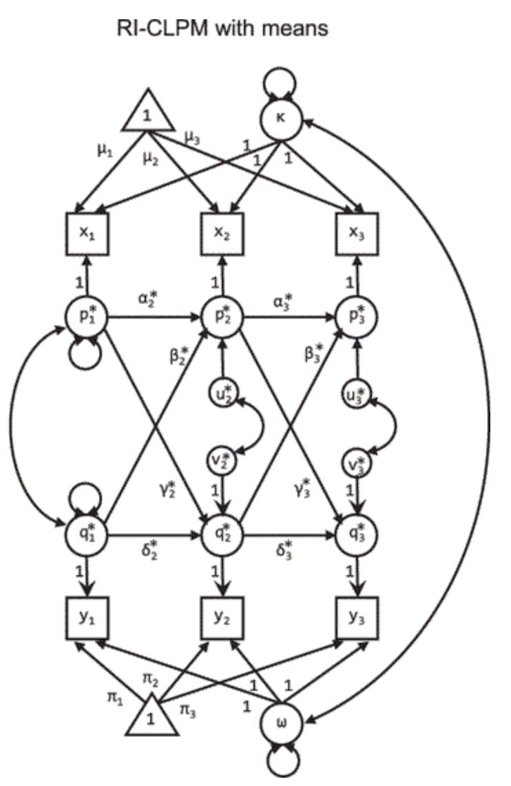

# Morphology, Grammar, and the Lexicon {#grammar}

Note:
  ~ *An earlier version of some of these analyses was first reported in @braginsky2015.*

How does abstract structure emerge during language learning? On some accounts, children's early syntax emerges from direct generalizations from particular lexical items, while on others, syntactic structure is acquired independently and follows its own timetable. CDI data can help us decide between these two views. In this chapter, we summarize the state of grammatical development across languages (noting the challenges posed by radically different representations of grammar across CDI forms). We also replicate and generalize analyses linking grammatical generalization to children’s vocabulary size (see Chapter \@ref(style) for links to vocabulary composition as well). We end by pursuing two relatively more novel directions. First, we investigate the idea that that age modulates the relationship between grammar and the lexicon. Second, we use structural equation modeling to evaluate the directionality of this relationship. 

```{r gram-prep_data, child="_grammar_lex.Rmd", eval=FALSE}
```

```{r gram-load_data}
vocab_step <- 0.01

grammar_summary <- read_feather("data/grammar/grammar_summary.feather")

grammar_summary <- grammar_summary %>%
  mutate(language = str_replace(language, "Quebecois", "Québécois"),
         instrument = str_replace(instrument, "Quebecois", "Québécois"))

grammar_combine <- grammar_summary %>%
  filter(coded_type == "combine")

grammar_morphosyntax <- grammar_summary %>%
  ungroup() %>%
  filter(coded_type %in% c("complexity", "word_forms")) %>%
  mutate(coded_type = factor(coded_type,
                             levels = c("word_forms", "complexity"),
                             labels = c("Word Forms", "Complexity"))) %>%
  filter(language != "French (French)") %>%  # FIXME?
  filter(language != "Slovak")

num_langs <- n_distinct(grammar_summary$language)
```


## Introduction

For many children, their first words are spoken in isolation. While these single word utterances sometimes seem to be picking out objects in the world (e.g., *ball!*), others seem to convey more complex ideas or desires (e.g., *up!* for *Mommy, pick me up!*). By two years of age, however, many children have acquired a large repertoire of words, and are beginning to use them in two- or three-word combinations (e.g., *Mommy up!* or *kitty sleep here*). These utterances will gradually increase in length and complexity in various ways, forming sentences that increasingly reflect the grammatical structure of their native language (e.g., *Mommy, the kitty is sleeping here*). Children also begin to add more verbs, adjectives, and other predicates to their working vocabularies (see Chapter \@ref(categories-syntactic)), and substantively increase their use of prepositions, articles, and other closed class forms that do grammatical work, including the productive use of inflectional morphemes (e.g., English past tense -*ed* or -*ing*).

Understanding the origins of grammar is critical because children's ability to use morphosyntactically-rich language is thought to reflect the uniquely-human mental machinery that enables speakers to comprehend and produce novel utterances that have never been heard in the input [@berko1958; @pinker1991]. The questions surrounding the development of grammar are challenging. How do abstract morphosyntactic structures emerge during language learning? What mechanisms underlie the formation of generalizations that support such inferences and allow children to apply them during language production? Does an understanding of the abstract rule-structure of language emerge from the interactions of individual words, or is that structure acquired independently and represented separately?

Broadly speaking, theoretical views on grammatical development generally take one of two forms. On nativist theories like Principles and Parameters [@chomsky1981;@baker2005], grammar emerges independently from lexical knowledge following its own, largely maturational, timetable.  Moreover, grammatical regularities are mentally represented in a format that is distinct from that used by the lexical system. In contrast, according to lexicalist theories, mental representations of morphosyntactic structure generally emerge from partial, probabilistic generalizations that are extracted over exposure to lexical items, and at least early in development, there may be little or no representation of morphosyntactic rules or regularities *per se* [@tomasello2003; @elman1996]. Even when syntactic structures are eventually represented, these representations are directly related to more concrete lexical structures [@bannard2009].

Historically, the study of individual differences has been critical to this debate.  While variation in word learning is generally uncontroversial, individual differences in grammatical development do not illuminate core processes of acquisition under a universalist, nativist perspective.  In contrast, lexicalist theories predict that variation in grammatical development is significant, in that such variation should be tightly yoked to variation in lexical development [@bates1999]. Research has shown that, as with lexical development, there is sizable variation in exactly when and how children move into using more grammatically complex utterances in their everyday speech.  While some children use primarily multi-word phrases and many closed class forms by 24 months, other children are still primarily producing nouns in single word utterances at that same age [e.g., @bates1988; @bates1999].  Moreover, there is also variation in the kinds of multi-word utterances that children produce.  For example, some children build up sentences from individual words (e.g., *want dat!*), whereas other children seem to produce utterances that reflect "unanalyzed" chunks of more complex speech (e.g., *iwantdodat!*).

### Correlations between grammar and the lexicon

Associations between individual differences in lexical and grammatical development have been robustly substantiated in the literature. In the original norming data from the English CDI Words & Sentences, children with more sophisticated grammatical productions were also those children with the largest vocabularies [@bates1994]. Using that same dataset, @marchman1994 found that size of verb vocabulary was concurrently related to children's overregularization of past tense inflections (e.g., *daddy goed*), productions that are viewed as a major milestone in the development of grammatical rule-based knowledge. 

Links between lexical development and grammar have also been reported longitudinally [@bates1988; @bates1997], in late talkers [e.g., @paul1996;@rescorla2000;@rescorla1997;@thal1997], early talkers [@thal1996;@thal1997], Spanish-English bilinguals [@marchman2004], and children with neurodevelopmental disorders, such as Williams syndrome [e.g., @singerharris1997]. Similar relationships have also been demonstrated in many other languages, including Slovenian [@marjanovic2013], Hebrew [@maital2000], Icelandic [@thordardottir2002], Italian [@caselli1999;@devescovi2005], Bulgarian [@andonova2015], Finnish [@stolt2009], Spanish [@mariscal2012; @thal2000], and German [@szagun2006]. Thus, these findings should be considered among the most reliable in the literature on CDI analyses. 

Finally, and perhaps most intriguingly, in behavior genetic studies of monozygotic and dizygotic twins, the relation between lexical and grammatical level has been found to be strongly heritable [@dale2000; @dionne2003]. In other words, even though genetic factors contribute relatively modestly to each aspect of language as assessed individually, the genetic factors that influence lexical growth are the same as those that influence grammatical growth, perhaps operating in a bidirectional manner.

While these studies are consistent with the view that vocabulary and grammar development are strongly associated developmentally, the interpretation of these relations is still under debate. Some researchers have interpreted these links to suggest that domain-general learning mechanisms guide the child’s construction of a working linguistic system at many different levels, in this case, learning words and learning grammatical rules [e.g., @elman1996].  As @bates1987 proposed many years ago, “the native speaker learns to map phrasal configurations onto propositions, using the same learning principles and representational mechanisms needed to map single words onto their meanings” (p. 163). 

In contrast, other proposals suggest that the process of learning words involves learning both their lexical-semantic and their morphosyntactic properties (e.g., in what constructions they can legally appear and what inflectional morphemes are required), and that grammatical knowledge is generally built up on a case-by-case basis [@tomasello2003]. Early word combinations are often highly routinized and situation specific, suggesting that learning grammar, like word learning, is guided by learning mechanisms that are item specific and frequency dependent. It is only later that grammatical structures become encoded in terms of their abstract syntactic form [e.g., @lieven1997; @tomasello2003]. And yet other accounts view the relation as reflecting mechanisms that operate in the opposite direction. On these views, grammatical analysis is a driving force behind word learning, such that the process of analyzing sentences into their constituent grammatical parts facilitates the further acquisition of lexical-semantic knowledge [@anisfeld1998;@naigles1990].  

Recently, a literature has developed using longitudinal models to assess the directionality of these relations. Such studies use cross-lagged models to investigate whether vocabulary size at earlier time-points predicts grammar at later times and vice versa. These models provide a perspective on growth over time that can help describe the directionality of the relationship, even though they do not allow for causal inferences about that directionality [@rogosa1980]. Unfortunately, studies using such methods have come to very different conclusions, perhaps owing to the different models and datasets they have used. In one study, @perez-leroux2012 found relations from  vocabulary size to grammar in 3--5 year-old Spanish speakers. In contrast, @brinchmann2018 found relations in the opposite direction, with stronger paths from grammar to vocabulary in a sample of 4--6 year-old Norwegian children. And using data from Spanish-English bilingual 2.5--4 year-olds, @hoff2017 found limited evidence for direct relationships between growth in grammar and vocabulary, and proposed that the observed relations were actually the result of third-variable explanations, perhaps from common input to both systems [@hoff2017]. Thus, the evidence at present is complex and unresolved.

### The current analyses 

In this chapter, we explore relations between estimates of children's vocabulary size based on the vocabulary checklist and responses on other sections of the Words & Sentences instruments. Many versions of the instruments provide indices of grammar learning by asking about children's use of inflected forms (e.g., *walked*) and overgeneralizations (e.g., *goed*), as well as the complexity of their multi-word combinations (e.g., *kitty sleeping* / *kitty is sleeping*).  While many studies have examined associations between lexical and grammatical development cross-linguistically, the scope and power of these early studies were limited, with few opportunities for direct comparisons of the nature or extent of these relations across multiple languages at the same time. In contrast, our data allow analyses of lexical-grammar relations with enhanced statistical power and broader cross-linguistic representation.  

In addition, we explore a hypothesis that has not been explicitly tested in these earlier studies: that there remains age-related variance in grammatical development unexplained by vocabulary development. While the overall relationship between grammar and the lexicon provides support for lexicalist theories, the identification of age-related variance would suggest the presence of developmental processes that regulate grammar learning, above and beyond those captured by measures of vocabulary size. Such age-related processes could be either maturational or experiential, and either domain-general (like working memory) or language-specific (like grammatical knowledge). Importantly, since both nativist and constructivist theories could in principle predict age-linked variance in grammatical development, our goal is not to differentiate these theories, but instead to test this novel prediction and explore its implications for future work on understanding the processes of grammatical development.

Further, addressing the question of directionality in the relationship between grammar and the lexicon, we fit structural equation models to longitudinal data from two datasets. We use a variant on the standard autoregressive cross-lag panel model that accounts for stable trait differences between individuals [@hamaker2015]. While such models do not provide conclusive evidence about the nature of developmental links between grammar and the lexicon [cf. @rogosa1980], they nevertheless provide suggestive evidence that -- at least for young children -- vocabulary drives grammatical growth, rather than vice versa.

A final contribution of our work is that, due to the size of our dataset, we are able to make more fine-grained distinctions than the initial cut between grammar and the lexicon. In particular, we distinguish morphology from multi-word syntax, since morphological generalizations might be more specifically dependent on vocabulary size than those requiring more global, sentence-level syntactic regularities. <!--Similarly, we distinguish age-related contributions to different parts of the vocabulary. Lexical items like verbs and even more so function words require some syntactic information to learn [@gleitman1990] and hence might be more linked to age-related factors that extend beyond vocabulary size.-->


## Methods

<!-- In all `r num_langs` languages included in these analyses, t -->
CDI forms typically contain both vocabulary checklists and other questions relevant to the child's linguistic development. All of the data reported here come from Words & Sentences type forms, administered to children ages `r min(grammar_summary$age)`--`r max(grammar_summary$age)` months (most in the 16--30 month range). In addition to the vocabulary checklist items, these forms typically contain a single item asking whether the child is combining words at all.  There is also a Word Form section, which asks whether the child produces each of around 30 morphologically inflected forms of nouns and verbs (e.g., _feet_, _ran_); and a Complexity section, which asks whether the child's speech is most similar to the syntactically simpler or more complex versions of around 40 sentences (e.g., _two foot_ vs. _two feet_, _there a kitty_ vs. _there's a kitty_).

Importantly, each instrument for languages other than English is not just a translation of the English form, but rather was constructed and normed to reflect the nature and early development of the lexicon and grammar of that language. Thus, there are substantial differences in the content of these items and their coverage of different morphological and grammatical phenomena. The major commonality is that the form developers have attempted to provide a comprehensive and representative survey of important developmental phenomena in their language. 

<!-- Word Form items are shown in Table \@ref(tab:gram-item-table). -->

```{r gram-items, eval=FALSE}
grammar_data_coded <- read_feather("data/grammar/grammar_data_coded.feather")

grammar_items <- grammar_data_coded %>%
  ungroup() %>%
  distinct(language, form, coded_type, definition)

write_feather(grammar_items, "data/grammar/grammar_items.feather")
```
  
```{r gram-item-table, results="asis"}
# dt_caption("All Word Form items included in these analyses.")
# grammar_items <- read_feather("data/grammar/grammar_items.feather") %>%
#   filter(language != "Slovak")
# grammar_items %>%
#   filter(coded_type == "word_forms") %>%
#   select(language, definition) %>%
#   group_by(language) %>%
#   mutate(i = 1:n()) %>%
#   spread(language, definition, fill = "") %>%
#   select(-i) %>%
#   kable(caption = "TODO")
```

<!-- Complexity items are shown in Table \@ref(tab:gram-complexity-table). -->

```{r gram-complexity-table, results="asis"}
# grammar_items %>%
#   filter(coded_type == "complexity") %>%
#   select(language, definition) %>%
#   group_by(language) %>%
#   mutate(i = 1:n()) %>%
#   spread(language, definition, fill = "") %>%
#   select(-i) %>%
#   kable(caption = "TODO")
```

Even more so than many parts of the CDI, responses to individual word form and grammatical complexity items should be interpreted with caution. Such items have not been validated as extensively as other parts of the CDI.^[At the risk of some circularity, we note that given the high degree of correlation with vocabulary (shown below), grammatical complexity items should inherit some presupposition of reliability and validity.] In addition, children's early speech is thought to be inconsistent from a grammatical perspective, occasionally alternating word orders beyond the standard word order of the language [e.g., @bowerman1973]. This last point goes double for word forms, which are often highly variable within individuals [@marcus1992]. Finally, word forms like "went" may be used by the child appropriately to denote motion without understanding the temporal marking that distinguishes it from the less-frequent "go."

Keeping these caveats in mind, to analyze lexical and morphosyntactic development, we derive several measures. Each child's vocabulary size is computed as the proportion of words on the corresponding CDI form that the child is reported to produce. Similarly, each child's Word Form score is the proportion of word forms they are reported to produce, and their Complexity score the proportion of complexity items for which they are reported to use the more complex form. We compute all of these quantities as proportions to make the scales comparable across languages. Note that different analyses often incorporate different amounts of data due to the presence or absence of specific sections (or data from those sections) in particular language datasets. 

## Results

We present four sets of results. First, we show analyses of the "combines" item, which is a binary item in which parents indicate whether their child is combining words. Second, we analyze the relations between vocabulary size and the Word Form and Complexity items. Third, we follow up on a pattern reflected in the "combining" item, namely age-related modulation of the grammar-lexicon relationship. Finally, we investigate the degree to which the age-related pattern is found in individual items. 

### Combines

```{r gram-combine-compare}
combine_compare <- grammar_combine %>%
  gather(predictor, value, age, production_prop) %>%
  mutate(predictor = factor(
    predictor, levels = c("age", "production_prop"),
    labels = c("Age (months)", "Productive vocabulary (proportion of items)"))) %>%
  filter(language != "Slovak", language != "French (Québécois)")

# slovak combine item is "your child uses 'fancy words' like bubble blower, brush and comb' - so I am excluding it. -MCF
# french (quebec) combines item switches schemes halfway though, excluding it -MB

combines_models <- combine_compare %>%
  group_by(language, form, predictor) %>%
  nest() %>%
  mutate(model = map(data, function(lang_data) {
    glm(positive ~ value, family = "binomial", weights = num_items, data = lang_data)
  }))

combines_fits <- combines_models %>%
  mutate(values = if_else(str_detect(predictor, "Age"),
                          map(data, ~seq(min(.$value), max(.$value), 1)),
                          map(data, ~seq(min(.$value), max(.$value), 0.01))),
         fits = map2(model, values,
                     ~broom::augment(.x, newdata = tibble(value = .y),
                                     type.predict = "response"))) %>%
  select(-data, -model, -values) %>%
  unnest(fits)

combines_age_means <- combines_fits %>%
  filter(str_detect(predictor, "Age")) %>%
  group_by(value) %>%
  summarise(mean_fitted = mean(.fitted))
age_percent <- function(age) {
  combines_age_means %>% filter(value == age) %>% pull(mean_fitted) %>% round(1)
}
age_1 <- 19
age_2 <- 25
```

Figure \@ref(fig:gram-combine-plot) shows the probability of a parent checking that their child combines words, plotted by the child's chronological age (left) and raw productive vocabulary size (right). As can be seen, across `r length(unique(combine_compare$language))` languages, there is some consistency in the developmental trajectories for this item. By `r age_1` months, around `r 100 * age_percent(age_1)`% of children are reported to be combining words; by `r age_2` months, around `r 100 * age_percent(age_2)`% are combining.
<!-- though this estimate is substantially earlier in Québécois French. One possibility is that the phrasing of the "combines" item contributes to this difference, in that some forms (including Québécois French, but also Norwegian and Danish) give examples of simple combinations, which could encourage earlier reporting. -->

```{r gram-combine-plot, fig.cap="Trajectory of the Combines item in each language across age (left) and vocabulary size (right).", dependson="gram-combine-compare"}
ggplot(combine_compare, aes(x = value, y = positive, colour = language)) +
  facet_wrap(~predictor, scales = "free_x", strip.position = "bottom") +
  geom_smooth(method = "glm", method.args = list(family = "binomial"),
              se = FALSE) +
  scale_colour_manual(values = lang_colours, name = "") +
  labs(x = "", y = "Combines words (probability)") +
  guides(colour = guide_legend(ncol = 3)) +
  theme(legend.position = "bottom",
        strip.placement = "outside")
```

Vocabulary-related trajectories are more variable, however. In general, children who were marked as combining had vocabularies larger than around 100 words. There are several notable exceptions, however. As noted in Chapter \@ref(vocabulary), raw Beijing Mandarin vocabulary in the WS form is unusually high, but the "combines" item does not appear to be comparably accelerated. Thus, Beijing Mandarin-learning children appear to be combining words only after producing substantially more words than children learning other languages. On the opposite side, children learning Québécois French and Korean were reported to be combining with quite small vocabularies.^[It appears possible that the Québécois French data have some issue for this item, given the very flat slope we observed. We speculate that this could perhaps be due to misinterpretation of the way the item is worded.]

To investigate the quantitative relationship between word combination (as measured with this item), age, and vocabulary, we fit a logistic mixed effects model predicting whether a child combines as a function of their vocabulary (as proportion of items), age, and interaction between vocabulary and age. We also included a random effect of language, with a random intercept and random slopes for vocabulary and for age. Coefficient estimates from this model are shown in Figure \@ref(fig:gram-combines-coefs).

```{r gram-combines_lmer, eval=FALSE}
age_offset <- min(grammar_combine$age)
combine_model_data <- grammar_combine %>%
  filter(language != "Slovak") %>%
  mutate(age = age - age_offset)
mod <- lme4::glmer(positive ~ production_prop * age + (production_prop + age | language),
                   family = "binomial", data = combine_model_data)
# full interaction doesn't converge

save(file = "data/grammar/grammar_combines_model.Rds", mod, age_offset)
```

```{r gram-combines-coefs, fig.height=3, fig.cap="Coeffient estimates from Combines model, with fixed effects in the top row and random effects in the bottom row."}
load("data/grammar/grammar_combines_model.Rds")

mod_effects <- broom::tidy(mod, effects = "fixed") %>%
  select(term, estimate, std.error, statistic) %>%
  mutate(group = "Fixed", language = "Fixed")
lang_effects <- lme4::ranef(mod, condVar = TRUE) %>% as_tibble() %>%
  select(-grpvar) %>%
  rename(estimate = condval, std.error = condsd, language = grp) %>%
  mutate(group = "Random",
         statistic = estimate / std.error) %>%
  left_join(mod_effects %>% select(term, fixed_estimate = estimate)) %>%
  mutate(estimate = fixed_estimate + estimate) %>%
  select(-fixed_estimate)

effects <- bind_rows(mod_effects, lang_effects) %>%
  filter(term %in% c("production_prop", "age")) %>%
  mutate(term = term %>% fct_relevel("production_prop", "age") %>%
           fct_recode("Vocabulary size (proportion)" = "production_prop",
                      "Age (months)" = "age")) %>%
  arrange(term, estimate) %>%
  mutate(language = fct_inorder(language))

ggplot(effects, aes(x = estimate, y = language, colour = language)) +
  facet_grid(group ~ term, scales = "free", space = "free_y", drop = TRUE) +
  geom_vline(xintercept = 0, linetype = .refline, colour = .grey) +
  ggstance::geom_pointrangeh(aes(xmin = estimate - 1.96 * std.error,
                                 xmax = estimate + 1.96 * std.error)) +
  scale_colour_manual(values = c(lang_colours, "Fixed" = "black"), guide = FALSE) +
  scale_x_continuous(breaks = c(-1, 1, seq(-5, 20, 5))) +
  expand_limits(x = c(-1, 1)) +
  labs(x = "Coefficient estimate (log odds ratio)", y = "") +
  theme(panel.grid.major.y = .coef_line,
        strip.text.y = element_blank())

ex_vocab <- 50
ex_age <- 16

vocabs <- seq(10, 680, 10)
ex_data_vocab <- tibble(production_prop = vocabs / 680,
                        age = ex_age - age_offset,
                        language = "English (American)")
ex_fits_vocab <- broom::augment(mod, newdata = ex_data_vocab) %>%
  as_tibble() %>%
  mutate(.fitted = arm::invlogit(.fitted),
         vocab = round(production_prop * 680),
         age = age + age_offset)
get_fit_vocab <- function(v) filter(ex_fits_vocab, vocab == v)$.fitted

ages <- seq(16, 30)
ex_data_age <- tibble(production_prop = ex_vocab / 680,
                      age = ages - age_offset,
                      language = "English (American)")
ex_fits_age <- broom::augment(mod, newdata = ex_data_age) %>%
  as_tibble() %>%
  mutate(.fitted = arm::invlogit(.fitted),
         vocab = round(production_prop * 680),
         age = age + age_offset)
get_fit_age <- function(a) filter(ex_fits_age, age == a)$.fitted

ex_p <- get_fit_vocab(ex_vocab)
multiplier <- 2
comp_vocab <- ex_fits_vocab %>% filter(.fitted > ex_p * multiplier) %>% filter(vocab == min(vocab))
comp_age <- ex_fits_age %>% filter(.fitted > ex_p * multiplier) %>% filter(age == min(age))
```

This model shows a large effect of vocabulary ($\beta$ = `r roundp(filter(mod_effects, term == "production_prop")$estimate)`, _t_ = `r roundp(filter(mod_effects, term == "production_prop")$statistic)`), with a relatively smaller effect of age ($\beta$ = `r roundp(filter(mod_effects, term == "age")$estimate)`, _t_ = `r roundp(filter(mod_effects, term == "age")$statistic)`). These effects mean that, for example, a `r ex_age`-month-old learning American English with a vocabulary size of `r ex_vocab` words has a `r roundp(ex_p * 100, 0)`% chance of combining words. At the same age of `r ex_age` months, a child is more likely to combine by about a factor of `r multiplier` if she has a vocabulary size of `r comp_vocab$vocab` words (at `r roundp(comp_age$.fitted * 100, 0)`%). Conversely, at the same vocabulary size of `r ex_vocab` words, a child is more likely to combine by about a factor of `r multiplier` if she is `r comp_age$age` months old (at `r roundp(comp_vocab$.fitted * 100, 0)`%). In addition, there is a substantial negative interaction of vocabulary and age ($\beta$ = `r roundp(filter(mod_effects, term == "production_prop:age")$estimate)`, _t_ = `r roundp(filter(mod_effects, term == "production_prop:age")$statistic)`), indicating that older children are more likely to be combining words, even with smaller vocabularies. This result parallels others reported below suggesting that there are age-related components in grammatical performance, at least for production of word combinations, that are unaccounted for by vocabulary alone.

<!-- Overall, although there was some cross-linguistic variation -- perhaps due to true variation and perhaps due to idiosyncrasies of individual forms or datasets -- and of course substantial individual variation, word combination emerged around 24 months and 100 words on average.  -->

### Grammar and Lexicon Relationship

```{r gram-vocab_models}
vocab_model <- function(inst_data) {
  lm(prop ~ I(production_prop ^ 4) + I(production_prop ^ 3) +
       I(production_prop ^ 2) + production_prop + 0, data = inst_data)
  # glm(cbind(positive, negative) ~ production_prop + 0, family = "binomial",
  #     data = inst_data)
  # MonoPoly::monpol(prop ~ production_prop + 0, data = inst_data)
}

vocab_models <- grammar_morphosyntax %>%
  group_by(language, instrument, coded_type) %>%
  nest() %>%
  mutate(
    model = map(data, vocab_model),
    rsq = map_dbl(model, ~summary(.x)$adj.r.squared),
    # rsq_print = sprintf("italic(r)² = %.2f", rsq)
    rsq_print = sprintf("italic(r)^2 == %.2f", rsq)
  )

vocabs <- tibble(production_prop = seq(0, 1, vocab_step))
vocab_fits <- vocab_models %>%
  mutate(fits = map(model, function(m) {
    vocabs %>% mutate(fitted_prop = predict(m, newdata = vocabs))
  })) %>%
  select(-data, -model) %>%
  unnest()
```

```{r gram-cvs}
cvs <- vocab_models %>%
  group_by(coded_type) %>%
  summarise(cv = cv(rsq), 
            sem = cv_sem(rsq), 
            n = n(), 
            measure = "production",
            signature = paste0(coded_type[1], "/vocab correlation"), 
            category = "Relations") %>%
  ungroup %>%
  select(-coded_type)

write_feather(cvs, "data/cvs/grammar_lex.feather")
```

```{r gram-grammar-data-plot}
plot_vocab_type <- function(type) {
  ggplot(filter(grammar_morphosyntax, coded_type == type),
         aes(x = production_prop, y = prop)) +
    facet_wrap(~language, ncol = 4) +
    coord_fixed() +
    geom_jitter(alpha = 0.2, size = 0.75, shape = 1) +
    geom_line(aes(y = fitted_prop), size = 1.2, colour = .pal()(1),
              data = filter(vocab_fits, coded_type == type)) +
    geom_text(aes(label = rsq_print), x = 0.15, y = 0.95, size = 3,
              family = .font, parse = TRUE,
              data = filter(vocab_models, coded_type == type)) +
    scale_x_continuous(limits = c(0, 1), expand = c(0.01, 0),
                       breaks = c(0, 0.5, 1), labels = c(0, 0.5, 1),
                       name = "Productive vocabulary (proportion of items)") +
    scale_y_continuous(limits = c(0, 1), expand = c(0.01, 0),
                       breaks = c(0, 0.5, 1), labels = c(0, 0.5, 1),
                       name = glue("{type} score (proportion of items)"))
}
```

We next examine the correlation between the proportion of Word Form items and Complexity items completed and the proportion of vocabulary items completed. First reported by @bates1994, these correlations are extremely robust, and can be observed in all of our datasets. Figure \@ref(fig:gram-grammar-plot-wordform) shows this relation for Word Form items. We fit generalized linear regressions predicting Word Form score or Complexity score as a function of linear, quadratic, cubic, and quartic terms of productive vocabulary size (subtracting the intercept to ensure that the function passed through the origin, because a vocabulary size of 0 necessarily implies scores of 0). The total *r*² for these relationships ranges from `r roundp(min(filter(vocab_models, coded_type == "Word Forms")$rsq))` to `r roundp(max(filter(vocab_models, coded_type == "Word Forms")$rsq))`.

```{r gram-grammar-plot-wordform, fig.cap="Each child's Word Forms score as a function of their vocabulary size in each language (curves show model fits).", dependson="gram-grammar-data-plot"}
plot_vocab_type("Word Forms")
```

Complexity items show the same relationship (Figure \@ref(fig:gram-grammar-plot-complexity)), typically with equal or greater strength (depending on data density and number of items). *r*² values vary from `r roundp(min(filter(vocab_models, coded_type == "Complexity")$rsq))` to `r roundp(max(filter(vocab_models, coded_type == "Complexity")$rsq))`.  Some ceiling effects are observed.

```{r gram-grammar-plot-complexity, fig.cap="Each child's Complexity score as a function of their vocabulary size in each language (curves show model fits).", fig.height=6, dependson="gram-grammar-data-plot"}
plot_vocab_type("Complexity")
```

Overall, these data add strong cross-linguistic support to the claim of @bates1994 and others that the emergence of grammatical competence in production is related across individuals to the size of the productive vocabulary. 

### Age effects

```{r gram-grammar_age_models}
get_inst_model <- function(inst_data) {
  lm(prop ~ I(production_prop ^ 4) * age + I(production_prop ^ 3) * age +
       I(production_prop ^ 2) * age + production_prop * age + 0,
     data = inst_data)
  # glm(cbind(positive, negative) ~ production_prop * age,
  #          family = "binomial", data = inst_data)
}

get_inst_predictions <- function(inst_data, inst_model) {
  data_shape <- list(age = seq(min(inst_data$age), max(inst_data$age)),
                     production_prop = seq(0, 1, vocab_step)) %>%
    cross_df()
  broom::augment(inst_model, newdata = data_shape, type.predict = "response")
}

grammar_models <- grammar_morphosyntax %>%
  group_by(language, instrument, coded_type) %>%
  nest() %>%
  mutate(
    model = map(data, get_inst_model),
    rsq = map_dbl(model, ~summary(.x)$adj.r.squared),
    predictions = map2(data, model, get_inst_predictions)
  )

num_age_admins <- grammar_morphosyntax %>%
  ungroup() %>%
  distinct(language, instrument, age, data_id) %>%
  count(instrument, age)

grammar_fits <- grammar_models %>%
  select(language, instrument, coded_type, predictions) %>%
  unnest() %>%
  group_by(language, instrument) %>%
  mutate(age_group = cut(age, 2, labels = c("younger", "older")))

grammar_fits_grouped <- grammar_fits %>%
  left_join(num_age_admins) %>%
  mutate(n = if_else(is.na(n), 0, as.numeric(n))) %>%
  group_by(language, instrument, coded_type, age_group, production_prop) %>%
  summarise(mean_fitted = weighted.mean(.fitted, n, na.rm = TRUE))

grammar_morphosyntax <- grammar_morphosyntax %>%
  group_by(instrument) %>%
  mutate(age_group = cut(age, 2, labels = c("younger", "older")))
```

```{r gram-grammar-age-groups}
age_group_models <- grammar_morphosyntax %>%
  group_by(instrument) %>%
  mutate(age_group = cut(age, 2, labels = c("younger", "older"))) %>%
  group_by(language, instrument, coded_type, age_group) %>%
  nest() %>%
  mutate(model = map(data, vocab_model),
         rsq = map_dbl(model, ~summary(.x)$adj.r.squared))

age_group_fits <- age_group_models %>%
  mutate(predictions = map(model, ~broom::augment(., newdata = vocabs))) %>%
  select(-data, -model) %>%
  unnest()
```

```{r gram-grammar-age-plots}
grammar_age_plot <- function(type) {
  ggplot(filter(grammar_morphosyntax, coded_type == type),
         aes(x = production_prop, y = prop, colour = age_group)) +
    facet_wrap(~language, ncol = 4) +
    coord_fixed() +
    geom_jitter(alpha = 0.1, size = 0.70, shape = 1) +
    # geom_line(aes(y = mean_fitted), size = 0.9,
    #           data = filter(grammar_fits_grouped, coded_type == type)) +
    geom_line(aes(y = .fitted), size = 0.9,
              data = filter(age_group_fits, coded_type == type)) +
    scale_x_continuous(limits = c(0, 1), expand = c(0.01, 0),
                       breaks = c(0, 0.5, 1), labels = c(0, 0.5, 1),
                       name = "Productive vocabulary size (proportion of items)") +
    scale_y_continuous(limits = c(0, 1), expand = c(0.01, 0),
                       breaks = c(0, 0.5, 1), labels = c(0, 0.5, 1),
                       name = glue("{type} score (proportion of items)")) +
    .scale_colour_discrete(name = "") +
    theme(legend.position = "top")
}
```

In our next analysis, we follow up on the relationship between age and grammatical ability found in the "combines" analysis above. In that analysis, we noted that less vocabulary was needed for older children to be marked as combining words, suggesting that other abilities can contribute or supplement vocabulary in achieving this milestone. We investigate this pattern in the full Word Form and Complexity item set by splitting data from each language by age. We plot the same curves as above, but separately for children older and younger than the median age (within each dataset). 

In essentially every language, for both Word Form (Figure \@ref(fig:gram-age-plot-wordforms)) and Complexity items (Figure \@ref(fig:gram-age-plot-complexity)), we see a higher curve for older children than younger children. This finding is consistent with the idea that grammatical development is faster per unit lexicon for older children (mirroring the negative interaction shown for the "combines" item). That is, an older child with comparable vocabulary to a younger one will likely be better at combining words. 

```{r gram-age-plot-wordforms, fig.cap="Each child's Word Forms score as a function of their vocabulary size in each language for children younger and older than the median (curves show model fits).", fig.height=5, dependson="gram-grammar-age-plots"}
grammar_age_plot("Word Forms")
```

```{r gram-age-plot-complexity, fig.cap="Each child's Complexity score as a function of their vocabulary size in each language for children younger and older than the median (curves show model fits).", fig.height=7, dependson="gram-grammar-age-plots"}
grammar_age_plot("Complexity")
```

This pattern is further summarized in Figure \@ref(fig:gram-grammar-diffs), where we show the area under the grammar/lexicon curve for younger and older children. The upward slope from younger to older of nearly every line demonstrates the consistency of the age effect, which we discuss further below. In addition, there is a trend for age effects to be larger in Complexity items compared to Word Forms, suggesting that factors beyond vocabulary size have a larger effect on syntax than on morphology.

```{r gram-grammar-diffs, fig.cap="Area under model fit curve for Word Forms score and Complexity score as a function of vocabulary size in each language for younger and older children.", fig.height=4.5}
grammar_areas <- age_group_fits %>%
  group_by(language, instrument, coded_type, age_group) %>%
  summarise(area = sum(.fitted * vocab_step, na.rm = TRUE))
#   summarise(area = sum(mean_fitted * vocab_step, na.rm = TRUE))

ggplot(grammar_areas, aes(x = age_group, y = area, colour = instrument)) +
  facet_wrap(~coded_type) +
  geom_point() +
  geom_line(aes(group = language)) +
  directlabels::geom_dl(aes(label = language),
          method = list("first.qp", directlabels::dl.trans(x = x - 0.2),
                        cex = 0.7, fontfamily = .font)) +
  scale_colour_manual(values = inst_colours, guide = FALSE) +
  labs(x = "", y = "Area of grammar score across vocabulary size") +
  expand_limits(x = 0)
```

### Individual items

```{r gram-item_models, eval=FALSE}
# item_age_model <- function(item_data) {
#   glm(value ~ age + 0, data = item_data, family = "binomial")
# }
# 
# item_vocab_model <- function(item_data) {
#   glm(value ~ production_prop + 0, data = item_data, family = "binomial")
# }
# 
# item_age_vocab_model <- function(item_data) {
#   glm(value ~ production_prop + age + 0, data = item_data, family = "binomial")
# }

item_age_vocab_model <- function(item_data) {
  glm(value ~ production_prop * age, data = item_data, family = "binomial")
}

# d <- gdc %>% filter(str_detect(definition, "doggie on table"))
# m <- glm(value ~ production_prop * age, data = d, family = "binomial")
# summary(m)
# broom::augment(m, type.predict = "response") %>%
#   ggplot(aes(x = production_prop, y = .fitted, colour = factor(age))) + geom_line()

item_models <- grammar_data_coded %>%
  filter(!is.na(value), coded_type != "word_endings") %>%
  # group_by(language, form) %>%
  # mutate(age0 = age - min(age)) %>%
  group_by(language, form, coded_type, item_id, definition) %>%
  nest() %>%
  mutate(#age_model = map(data, item_age_model),
         #vocab_model = map(data, item_vocab_model),
         age_vocab_model = map(data, item_age_vocab_model))

item_fits <- item_models %>%
  mutate(age_vocabs = map(data, function(df) {
    cross_df(list(production_prop = seq(0, 1, vocab_step),
                  age = min(df$age):max(df$age)))
  }),
  fits = map2(age_vocab_model, age_vocabs, function(avm, av) {
    broom::augment(avm, newdata = av, type.predict = "response")
  })) %>%
  select(-data, -age_vocab_model) %>%
  unnest()

write_feather(item_fits, "data/grammar/_item_fits.feather")

demo_items <- c("kitty go away / kitty went away", "you fix it / can you fix it")
demo_fits <- item_fits %>%
  filter(definition %in% demo_items) %>%
  mutate(age_extremes = case_when(age == max(age) ~ "oldest",
                                  age == min(age) ~ "youngest"))
write_feather(demo_fits, "data/grammar/demo_fits.feather")

item_effects <- item_models %>%
  # gather(model_predictors, model, age_model, vocab_model, age_vocab_model) %>%
  gather(model_predictors, model, age_vocab_model) %>%
  mutate(coefs = map(model, broom::tidy),
         AIC = map_dbl(model, AIC),
         converged = map_lgl(model, ~.x$converged)) %>%
  select(-data, -model) %>%
  unnest()

write_feather(item_effects, "data/grammar/item_effects.feather")

# model_comp <- item_effects %>%
#   filter(converged,
#          model_predictors %in% c("vocab_model", "age_vocab_model")) %>%
#   distinct(language, coded_type, item_id, definition, model_predictors, AIC) %>%
#   spread(model_predictors, AIC) %>%
#   mutate(AIC_diff = age_vocab_model - vocab_model,
#          AIC_gain = AIC_diff < 0)
```

```{r gram-item_age_effects}
item_effects <- read_feather("data/grammar/item_effects.feather")

complexity_cats <- items %>%
  filter(type == "complexity") %>%
  distinct(language, form, item_id, complexity_category)

age_effects <- item_effects %>%
  filter(term != "(Intercept)", coded_type != "combine") %>%
  # filter(converged, model_predictors == "age_vocab_model", term == "production_prop:age") %>%
  left_join(complexity_cats) %>%
  mutate(
    signif = p.value < 0.05,
    coded_type = if_else(
      !is.na(complexity_category) & nchar(complexity_category) > 0,
      complexity_category, coded_type),
    coded_type = factor(
      coded_type,
      levels = c("combine", "word_forms", "morphology", "syntax", "complexity"),
      labels = c("Combine", "Word Forms", "Complexity (morphological)",
                 "Complexity (syntactic)", "Complexity (other)")),
      term = term %>%
           fct_recode("\nAge" = "age",
                      "\nVocabulary size" = "production_prop",
                      "Interaction between age\n and vocabulary size" = "production_prop:age")
  ) %>%
  group_by(language) %>%
  filter(n_distinct(coded_type) > 1) %>%
  ungroup() %>%
  arrange(language, form, term, desc(estimate)) %>%
  mutate(order_item = paste(language, term, item_id, sep = "_"),
         order_item = factor(order_item, levels = order_item))

age_effect_means <- age_effects %>%
  group_by(language, coded_type, term) %>%
  summarise(mean_estimate = mean(estimate))
```

In our next analysis, we examine the individual items on the Word Form and Complexity sections. Given the heterogeneous nature of the CDI instruments, particularly in the Complexity sections, we attempted a more fine-grained item-analysis by classifying items as capturing either more morphological or more syntactic phenomena. Items for which the difference between the simple and complex sentences is in the inflection of a noun or verb (such as *kitty go away* / *kitty went away*) were coded as Morphological. Items were coded as Syntactic if they involved the use of some sentence-level syntactic construction (such as *you fix it* / *can you fix it*). Some languages' items involved a mix of the two or otherwise didn't fit into this dichotomy, in which case they were coded as Other.

We then a fit logistic regression separately for every item, predicting whether children produced the item from vocabulary size and age. Figure \@ref(fig:gram-item-effects-demo) shows the resulting model fits for two example items. For both items, children with larger vocabulary sizes are more likely to produce it than children with smaller vocabulary sizes (the curves have positive slopes), and older children are more to produce it than younger children (the older curves are higher than the younger curves). For the item on the left, the interaction between vocabulary size and age is very small (all the curves have roughly the same slope), while for the item on the right this interaction is large (the older curve is much steeper than the younger curve, indicating that at larger vocabulary sizes the advantage for older children is larger).

Figure \@ref(fig:gram-item-effects-plot) shows for each item, the coefficients of vocabulary size, age, and their interaction. In general, age effects are smallest for Word Form items, larger for Morphological Complexity items, and largest for Syntactic Complexity items, suggesting that more syntactic phenomena likely have greater age contributions.

```{r gram-item-effects-demo, fig.height=3, fig.cap="Model fits for two example items."}
demo_fits <- read_feather("data/grammar/demo_fits.feather")

ggplot(demo_fits, aes(x = production_prop, y = .fitted, colour = factor(age))) +
  facet_wrap(~definition) +
  coord_equal() +
  geom_line() +
  directlabels::geom_dl(aes(label = age_extremes),
                        method = list("last.points", directlabels::dl.trans(x = x + 0.1),
                                      fontfamily = .font, cex = 0.7)) +
  .scale_colour_numerous(guide = FALSE) +
  scale_x_continuous(limits = c(0, 1.2), breaks = seq(0, 1, 0.25)) +
  labs(x = "Vocabulary size (proportion of items)",
       y = "Model fit probability of producing")
```

```{r gram-item-effects-plot, fig.cap="Coefficient estimates (as log odds ratio) for each grammar item in each language. Line segments indicate means effect for category.", fig.height=14, fig.width=8, out.width="90%"}
term_plot <- function(term_data) {
  term_name <- unique(term_data$term)
  ggplot(term_data, aes(colour = coded_type)) +
    facet_wrap(~language, scales = "free", ncol = 1, strip.position = "right") +
    geom_vline(xintercept = 0, linetype = .refline, colour = .grey) +
    geom_rug(aes(x = mean_estimate), sides = "t", length = unit(0.1, "npc"),
             size = 1, data = age_effect_means %>% filter(term == term_name)) +
    geom_point(aes(y = order_item, x = estimate, shape = signif), size = 1.2) +
    .scale_colour_discrete(name = "") +
    guides(colour = guide_legend(nrow = 2)) +
    scale_y_discrete(breaks = NULL) +
    scale_shape_manual(values = c(21, 19), guide = FALSE) +
    labs(y = "", x = "", title = term_name) +
    theme(plot.title = element_text(hjust = 0.5, size = rel(0.8)),
          legend.direction = "horizontal", legend.justification = "center",
          legend.box.just = "top")
}
term_plots <- age_effects %>%
  split(.$term) %>%
  map(term_plot)

term_plots[-length(term_plots)] <- map(term_plots[-length(term_plots)], ~. + theme(strip.text = element_blank()))
term_plots[[2]] <- term_plots[[2]] + labs(x = "Effect on production of item")
legend <- cowplot::get_legend(term_plots[[1]])
term_plots <- map(term_plots, ~. + guides(colour = FALSE))

cowplot::plot_grid(
  cowplot::plot_grid(NULL, legend, NULL, nrow = 1),
  cowplot::plot_grid(term_plots[[1]], term_plots[[2]], term_plots[[3]], nrow = 1),
  ncol = 1, rel_heights = c(0.1, 1), align = "hv"
) %>%
  cowplot::ggdraw()
```

Building on previous analyses that showed a strong relationship between lexical and grammatical development, we added age into this relationship. Across languages, our measures of syntactic development consistently showed greater age modulation than measures of morphological development. Further distinguishing between items that were more reflective of morphology than syntax, we again found greater age effects for more syntactic items. Thus, this analysis provides evidence for a relationship between syntactic development and age that is _not_ captured by lexical development.

## Longitudinal relationships

In our next set of analyses, we take advantage of the presence of longitudinal data in two languages (Norwegian and American English) to investigate the relationship between vocabulary size and grammatical ability, as operationalized by average Complexity score. As mentioned above, this relationship has been the subject of a variety of previous investigations using longitudinal data [@dionne2003;@moyle2007;@perez-leroux2012;@hoff2017;@brinchmann2018], but outcomes have been contradictory. Given the heterogeneity of these studies, results could differ for a variety of reasons, including the language background of the participants, the target age range of the study (which ranged from 2--6 years old), and the nature of the specific models being fit to the data. 

Further, a specific technical concern underlies one potential source of variance. The standard method for examining reciprocal relationships between longitudinally-measured variables is the cross-lagged panel model (CLPM). While this model does not allow for causal inferences [@rogosa1980], it is a convenient way to estimate temporal precedence in the relationships between variables measured over multiple time points; many of the previous studies have used variants of this model. However, in cases where the measured constructs show stability within individual -- as is clearly the case for language-related measures -- these models are misspecified, since they assume that the *only* source of consistency between individuals is temporal autocorrelation [@hamaker2015]. To address this issue, @hamaker2015 propose the random intercepts CLPM (RI-CLPM), which adds a latent intercept that accounts for individual variation across observation timepoints (shown in Figure \@ref(fig:gram-ri-clpm)). This is the approach used by @brinchmann2018, and they find significantly better fits for the RI-CLPM on their vocabulary/grammar data than the standard CLPM. Hence, we use this model in our analyses below. 

```{r gram-ri-clpm, fig.cap="(ref:gram-ri-clpm-cap)", out.width="60%"}

```

(ref:gram-ri-clpm-cap) The random intercept cross-lagged panel model. Figure reproduced from @hamaker2015. Circles represent observed variables, squares represent latent variables, and directed edges represent regression effects.

```{r gram-ri-clpm-data}
load("data/grammar/clpms.Rds")
```

We include data from two different longitudinal datasets. The first is a group of children from a study conducted by Virginia Marchman with English-speaking children in Dallas, TX (N = `r length(unique(dallas$original_id))`). This dataset includes children with three waves of data collection centered around 18, 24, and 30 months; we included children if they contributed to two waves (N = `r sum(3-rowSums(is.na(dallas_wide[,2:4])) == 2)`) or all three waves (N = `r sum(3-rowSums(is.na(dallas_wide[,2:4])) == 3)`), for a total of `r nrow(dallas_wide)` children. The offsets between waves varied somewhat in these data, but for simplicity, we split all administrations into three time points: 18--21 months, 22--25 months, and 26--30 months.

The second dataset is a large group of longitudinal administrations in the Norwegian normative data, including a total of `r format(length(unique(norway$original_id)), big.mark = ",")` children. These children's parents were invited to complete multiple CDIs online every month or few months, with many parents completing two and a small number completing 10 or more. For purposes of discrete analysis, we binned these continuous data into two-month waves from 18--35 months (the small number of 36-month-olds were included in the oldest wave). We then included children with two or more administrations, each falling in a different wave (N = `r nrow(norway_wide)`). Table \@ref(tab:gram-norway-table) shows the distribution of how many observations are available for children across different waves.

```{r gram-norway-table}
norway_n <- norway_wide %>%
  select(original_id, starts_with("production")) %>%
  gather(time, production, starts_with("production")) %>%
  group_by(original_id) %>%
  summarise(observations = 10 - sum(is.na(production))) %>%
  count(observations)

# norway_n %>%
#   slice(rep(1:n(), observations)) %>%
# ggplot(aes(x = observations)) +
#   coord_flip() +
#   # geom_point()
#   geom_dotplot(binwidth = 1, dotsize = 0.8, stackratio = 1.2) +
#   geom_text(aes(label = n, y = -0.01), hjust = 1, family = .font, size = 12, data = norway_n) +
#   scale_x_reverse() +
#   expand_limits(y = -0.04) +
#   theme(axis.line = element_blank(), axis.title = element_blank(), axis.text = element_blank(),
#         axis.ticks = element_blank(), panel.border = element_blank())

kable(norway_n,
      caption = "Number of children in the Norwegian longitudinal dataset with each number of observations.",
      col.names = c("Number of observations", "Number of children")) %>%
  kable_styling(full_width = FALSE)
```

Using these two datasets, we fit RI-CLPM models.^[We gratefully acknowledge code from [jflournoy.github.io/2017/10/20/riclpm-lavaan-demo](https://jflournoy.github.io/2017/10/20/riclpm-lavaan-demo).] These models measure the magnitude of the reciprocal relationships between grammar and vocabulary over time. Coefficient weights on the paths between latent grammar and vocabulary are then interpretable as temporal influences. Following the RI-CLPM specification in @hamaker2015, we posited latent variables $\kappa$ and $\omega$ that describe stability in vocabulary and grammar, respectively. 

Figure \@ref(fig:gram-dallas-plot) shows the fitted model for the English data. Coefficient estimates from vocabulary to grammar are large and significant ($\beta_{p1-c2}$ = `r roundp(filter(lavaan::parameterEstimates(clpm_fit_dallas), label == "gamma2")$est)`, _p_ `r print_pvalue(filter(lavaan::parameterEstimates(clpm_fit_dallas), label == "gamma2")$pvalue)`, $\beta_{p2-c3}$ = `r roundp(filter(lavaan::parameterEstimates(clpm_fit_dallas), label == "gamma3")$est)`, _p_ `r print_pvalue(filter(lavaan::parameterEstimates(clpm_fit_dallas), label == "gamma3")$pvalue)`). These are consistently higher than estimates from grammar to vocabulary (which are both small and non-significant).

```{r gram-dallas-plot, fig.cap="RI-CLPM model fit to English (American) data. Path diagram for latent (circles) and observed (squares) variables. Edges show estimated regression coefficients, scaled and colored by estimate magnitudes. Uppercase P variables indicate production coefficients, while C variables indicate grammatical complexity coefficients. Lowercase square variables are observed data. kpp and omg denote global intercepts.", fig.height=4}
dallas_plot <- semPlot::semPlotModel(clpm_fit_dallas)
semPlot::semPaths(dallas_plot, what="est",
                  intercepts = FALSE,
                  structural = FALSE, 
                  layout = matrix(data = c(1, 0, 2, 0, 3, 0, 
                                           1, 4, 2, 4, 3, 4,
                                           2, -1, 2, 5,
                                           1, 1, 2, 1, 3, 1, 
                                           1, 3, 2, 3, 3, 3), 
                                  byrow=TRUE, ncol = 2),
                  edge.label.cex = 1)
```

Figure \@ref(fig:gram-norway-plot) shows the analogous fitted model for the Norwegian data.^[Because of the high degree of missingness in this dataset, fititng these models was difficult and so we interpret standard errors with some caution.] Coefficient estimates from vocabulary to grammar are large; as in the English data, these are consistently higher than estimates from grammar to vocabulary (which are both small and non-significant). Coefficient estimates are shown in Table \@ref(tab:gram-norway-clpm-tab). 

```{r gram-norway-plot, fig.cap="RI-CLPM model fit to Norwegian data. Plotting conventions are as above; P indicates production, while C indicates complexity.", fig.height=5}
norway_plot <- semPlot::semPlotModel(clpm_fit_norway)
semPlot::semPaths(norway_plot, what="est", 
                  structural = FALSE, 
                  intercepts = FALSE, 
                  layout = matrix(data = c(1, 0, 2, 0, 3, 0, 4, 0, 5, 0, 
                                           6, 0, 7, 0, 8, 0, 9, 0, 10, 0,
                                           1, 4, 2, 4, 3, 4, 4, 4, 5, 4, 
                                           6, 4, 7, 4, 8, 4, 9, 4, 10, 4,
                                           5.5, -1, 5.5, 5,
                                           1, 1, 2, 1, 3, 1, 4, 1, 5, 1, 
                                           6, 1, 7, 1, 8, 1, 9, 1, 10, 1,
                                           1, 3, 2, 3, 3, 3, 4, 3, 5, 3, 
                                           6, 3, 7, 3, 8, 3, 9, 3, 10, 3), 
                                  byrow=TRUE, ncol = 2),
                  edge.label.cex = 1)
```

```{r gram-norway-clpm-tab}
params_table <- lavaan::parameterEstimates(clpm_fit_norway) %>%
  filter(str_detect(label, "beta") | str_detect(label, "gamma")) %>% 
  select(lhs, rhs, est, se, pvalue) %>%
  mutate(pvalue = if_else(pvalue < 0.001, "< 0.001", roundp(pvalue, 3)),
         est = roundp(est, 3),
         se = roundp(se, 3)) %>%
  rename(Predicted = lhs, Predictor = rhs, `$\\beta$` = est, SE = se)

colnames(params_table)[5] <- cell_spec("p", italic = TRUE)
kable(params_table, escape = FALSE, #col.names = c("Predicted", "Predictor", "$\beta$", "SE"),
      align = c(rep("l", 2), rep("r", 3)),
      caption = "Coefficient estimates for cross-lag parameters in the Norwegian regression model." ) %>%
  kable_styling(full_width = FALSE)
```


In both of these cases, we see strong evidence for cross-lagged influences of vocabulary on grammar, but _not_ grammar on vocabulary. These results are consistent with the idea that, early in acquisition, learning vocabulary items provides the materials for generalization of grammatical constructions and rules -- following the general line of speculation in @bates1994. In contrast, our findings are *prima facie* less consistent with results that show smaller relationships [@hoff2017] or grammar-to-vocabulary linkages [@brinchmann2018], both in older children. But in fact, we might expect a reversal in directionality for these relationships over time. Early in development, some vocabulary is necessary to get grammar learning off the ground. But later on, as grammatical rules stabilize (probably after age 3), grammar then serves to help elucidate the meanings of complex sentences, allowing syntactic bootstrapping of new word meanings [@gleitman1990]. 

## Discussion

In this chapter, we revisited classic findings on the relationship between grammar and the lexicon and explored novel questions regarding the role of age in this relation. Our results provide general support for a constructivist view, in that, in these `r num_langs` languages, variance in vocabulary production strongly aligns with variance in grammar. However, we also estimated additional age-related contributions, specifically contrasting the links to morphological forms vs. syntactic constructions. In general, we find that measures of grammar that are more closely aligned with syntax are modulated by age to a greater extent than those reflecting inflectional morphology.

As with the correlations reported in Chapter \@ref(gesture), parent bias is a potential confound for these correlational analyses. If some parents tend to over-report on their child's language more than others do -- for reasons such as sensitivity, optimism, greater time spent with the child -- then this over-reporting would likely extend across linguistic domains. Thus, in principle an observed correlation between two sections of a single parent report form could be driven by parent bias acting independently on each section without any connection. 

Two studies provide evidence against this deflationary hypothesis. First, @moyle2007 used a combination of parent report and standardized assessments (e.g., the Preschool Language Scale) to provide evidence for the same relation in both typically-developing and late-talking children from 2 to 5 years of age. Second, @brinchmann2018 give a similar analysis using cross-lagged structural equation models. Critically, their work relied only on direct testing of the child (not parent report) using standardized instruments. In their model, they found a strong correlation between the time-invariant (trait-like) components of vocabulary and grammar (_r_ = 0.72). While this correlation is somewhat smaller than the correlations we report here, it is still quite large -- and it appears in a model that also controls for a number of other relationships. 

Intriguingly, however, the @brinchmann2018 study suggests that as grammar-lexicon correlations are cross-lagged, grammar to vocabulary links are stronger than vocabulary to grammar links, although neither could be characterized as strong. We followed up on this finding by fitting similar models to our own data, showing the opposite result (stronger vocabulary to grammar links across two languages). One potential reconciliation of these two findings is that early in development, more vocabulary allows for more generalization, but then later, syntactic bootstrapping effects are more important. Regardless, combined with the @moyle2007 study, these findings suggest that reporting bias is very likely not the sole cause of the correlations we observed.

Our analyses go beyond earlier work by also investigating the relationship of age to vocabulary and grammar. One possibility is that age-related developments are dependent on maturational factors that operate on grammatical development in a domain-specific way, independent of lexical-semantic processes. Another possibility is that age-related effects are a reflection of domain-general learning mechanisms, such as attention or working memory, that provide differential support for sentence-level processes than word-internal ones [@gathercole2013]. Yet another possibility is that by an older age, children have received more linguistic input from which to generalize grammatical structure. Future studies should also explore the extent to which lexical and age-related processes are shaped, either independently or in tandem, by features of the learning environments that children experience [e.g., @weisleder2013;@hoff2017;@brinchmann2018].

In sum, questions about the nature of morphosyntactic representations in early language have often seemed deadlocked. By mapping out developmental change across large samples and multiple languages, our findings challenge theories from across the full range of perspectives to more fully describe the mechanistic factors underlying the interaction of vocabulary, grammar, and development. 
