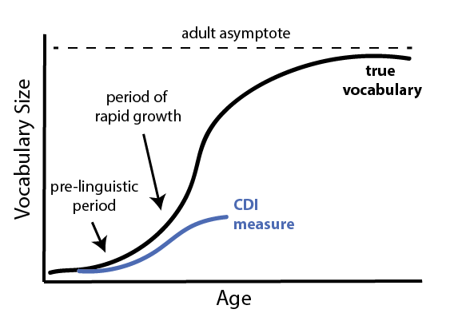

# Vocabulary Development {#vocab}

> Far from simply reflecting noise in our measuring instruments or variability in low-level aspects of physiological maturation, the variations that we will document (in vocabulary development) are *substantial,* *stable,* and have their own *developmental course.* Because this variation is substantial, it is critical for defining the boundary between normal and abnormal development; because it is stable, it provides a window onto the correlates and (by inference) the causes of developmental change; and because it has its own developmental course, it can be used to pinpoint critical developmental transitions that form the basis for theories of learning and change. (Bates et al., 1995)

This chapter focuses on one canonical view of CDI data, in which each child is represented by a single vocabulary score: the proportion of words that child knows, out of the total in the form. (We discuss why we use raw score, as opposed to other measures, in \@ref(appendix-psychometrics)). We begin by quantifying the median pattern of vocabulary growth observed in our data; we then turn to characterizing variability across individuals in these data.  

This chapter trades in variability, but vbariability is only meaningful in the case that it is stable; that is, that it reflects signal about indiviuals (or cultures) rather than measurement error. With respect to the CDI, the strong evidence for the reliability and validity of the forms -- reviewed in Chapter \@ref(intro) and in @fenson2007 -- provides support for the contention that observed variability is meaningful. Such evidence has primarily been collected for the English CDI, however. In this chapter we examine variability across the full set of languages, and it is worth noting up front that we project the reliability and validity of the English instrument to its adaptations. 

One study nicely illustrates why such an approach might not be misguided. @bornstein2012 collected multiple language measures at 20 and 48 months in a sample of nearly 200 children and used a structural equation model to estimate the stability of a single latent construct, language ability. Essentially all measures related strongly to this latent variable and the coefficient on its stability over time was $r = .84$, suggesting that early language is quite stable, at least when measured appropriately. Notably, the ELI, a precursor to the CDI, was included in the measures at 20 months and was found to correlate with the 20-month latent construct at $r = .87$. 

This finding -- along with the other evidence, mentioned above -- justifies the implicit conceptual model of the following analyses. That model is that there is a single quantity, early language ability, that is stably measured by parent report and that can be approximated as the raw proportion of words "understood" or "said and understood" on CDI forms. 

```{r 3_vocab_admins}
num_words <- items %>%
  filter(type == "word") %>%
  group_by(language, form) %>%
  summarise(n = n())

vocab_data <- admins %>%
  dplyr::select(data_id, language, form, age, sex, 
         mom_ed, birth_order, production, comprehension) %>% 
  left_join(num_words) %>%
  mutate(no_production = n - production)

min_age <- min(vocab_data$age)
max_age <- max(vocab_data$age)

taus <-  c(0.1, 0.25, 0.5, 0.75, 0.9)
ages <- 8:18
```
## Central Tendencies 

One first question we can ask about CDI data is about its central tendency -- the median pattern of vocabulary growth. Our general expectation is shown below.



This image reveals a number of patterns that are explored in this and subseqeuent chapters. The CDI necessarily captures a small fraction of any individual's true vocabulary, but even within this range there are specific questions that are usefully addressed. The question of the exact slope of children's growth, especially in the period immediately after the emergence of language, is treated in Chapter \@ref(styles) -- this question is sometimes posed as whether children undergo a vocabulary "spurt" [@ganger2004]. On the other side of the CDI curve, the question of the divergence between CDI-measured vocabulary and true vocabulary (and whether true vocabulary can be recovered via a statistical correction) is treated in Appendix \@ref(appendix-vocab-estimation). In the current chapter, we focus on the middle section of the CDI curve, in which children's vocabulary is neither at the floor or the ceiling of the instrument. 


### Commonalities across languages

```{r 3_medians_production_wg, fig.cap="Median production using the Words and Sentences form. Included are only lanugages where there are more than 200 administrations total."}
lang_ns <- admins %>% 
  group_by(language, form) %>% 
  summarise(n_admins = n())

medians <- vocab_data %>%
  group_by(form, language, age) %>%
  summarise(production = median(production), 
            comprehension = median(comprehension), 
            production_prop = median(production/n), 
            comprehension_prop = median(comprehension/n), 
            n = n()) %>%
  left_join(lang_ns) 

ggplot(filter(medians, form %in% form %in% WGs, n_admins > 200), 
       aes(x = age, y = production, col = interaction(language, form))) + 
  geom_point(aes(size = n), alpha = .5) + 
  geom_smooth(se=FALSE, span = 1, size = .5) +  
  xlab("Age (months)") + 
  ylab("Median Production") +
  theme(legend.position = "bottom",
        legend.text=element_text(size=6)) + 
  scale_color_discrete(name = "") + 
  scale_size(guide = FALSE)
```

Plotted above are the median patterns of growth for early production. Rather than showing proportions, as we will do more standardly throughout the book, here individual item totals are plotted.^[As @eriksson2012 write, "Using raw data assumes that each form is exhaustive, while using percentages assumes that each form is equally exhaustive. Neither is correct and the truth lies somewhere in between."] In general, the median child before the first birthday is reported to produce a small number of words. (These data raise a number of questions about the specific reliability of very early parent reports, which we take up below.) Overall, however, these curves accord relatively well with our intuitive sense of early vocabulary development: they reveal that children before their first birthday tend to speak at most only a few words, but that production accelerates across the second year.

```{r 3_medians_production_ws}
ggplot(filter(medians, form %in% WSs , n_admins > 200), 
       aes(x = age, y = production, col = interaction(language,form))) + 
  geom_point(aes(size = n), alpha = .5) + 
  geom_smooth(se=FALSE, span = 1, size = .5) +  
  xlab("Age (months)") + 
  ylab("Median Production") +
  geom_hline(yintercept = 50, lty = 2) +
  theme(legend.position = "bottom",
        legend.text=element_text(size=6)) + 
  scale_color_discrete(name = "") + 
  scale_size(guide = FALSE)

```

This acceleration is even clearer when looking at production reports from older children using Words and Sentences. In every language, we see the median child is reported to produce 50 words between 16 and 20 months. As we will see below, this analysis masks the tremendous variability apparent during this period. In addition, as we discuss below, languages vary considerably in the absolute number of words reported. (We discuss Mandarin in particular, which is a major outlier from other languages in this analysis). Nevertheless, there are still substantial consistencies between languages. 

During the period 24-30 months, we see children beginning to produce a large enough sample of words that curves are leveling out. Presumably this leveling does not reflect a slowing in the rate of acquisition, which many authors assume continues unabated for many years [@bloom2001]. Instead, it reflects the limitations of the CDI instrument, in that there are many possible "more advanced" words that they could be learning, of which only a small subset are represented on any form. (See Appendix \@ref{appendix-vocab-estimation) for estimates of how many words children actually might know.)

```{r 3_medians_comprehension_wg}
ggplot(filter(medians, form %in% WGs, n_admins > 200), 
       aes(x = age, y = comprehension, col = interaction(language, form))) + 
  geom_point(aes(size = n), alpha = .5) + 
  geom_smooth(se=FALSE, span = 1, size = .5) +  
  theme(legend.position = "bottom") + 
  xlab("Age (months)") + 
  ylab("Median Comprehension") + 
  # geom_hline(yintercept = 50, lty = 2) + 
  theme(legend.position = "bottom",
        legend.text=element_text(size=6)) + 
  scale_color_discrete(name = "") + 
  scale_size(guide = FALSE)

mins <- medians %>% 
  filter(n_admins > 200) %>%
  filter(form %in% WGs, age == 8) 
```

We next turn to comprehension. Comprehension is only queried on the Words and Gestures form. Reported comprehension increases much faster than production; so much so that most parents are reporting that their children understand most words on the form by 18 months. See Chapter \@ref(style) for discussion of the differences in the balance between comprehension and production between children. As with the production data, we see substantial differences across languages in reported vocabulary (see below). 

One striking aspect of comprehension data is how early comprehension is reported.  For example, from 8 months, we see parents reporting medians of `r min(mins$comprehension)` (`r mins$language[mins$comprehension == min(mins$comprehension)]`) and `r max(mins$comprehension)` (`r mins$language[mins$comprehension == max(mins$comprehension)]`) words. Intuitively, to many reseachers (and parents) these high numbers feel unlikely. A spate of recent infancy experiments suggest that in fact, children in the second half of the first year do have some fragmentary representations of many common words available [e.g., @tincoff, @bergelson2012, @bergelson2017]. The representations revealed in these tasks are quite weak -- often amounting to a 2-5% difference in looking to a target on hearing a word uttered -- but, depending on the criterion used by parents, may be what is detected in these early reports. Thus, these estimates may not be as far off as we initially suppose.^[An alternative possibility is that *both* accounts are true, but unconnected: 8-month-olds could in fact know some common words, but parents could be overstimating their vocabulary based on observed behaviors -- in essence, parents could be right, but for the wrong reasons.]

### Cross-language differences

What causes the differences between languages observed above? In this discussion, we examine production on the Words and Sentences form, as the data are the densest and most reliable for this instrument. 

We first discuss the case of Mandarin. Mandarin WS data are reported by @tardif2009 in a study of both Mandarin- and Cantonese-learning children. They also show the pronounced Mandarin advantage plotted above. They investigate possible explanations, given that the administration and sampling procedures were similar in these two languages. The children in the Mandarin sample are nearly all monolingual, only children; but these factors did not account for variation between samples, and so @tardif2009 speculate that structural factors regarding Mandarin (e.g., phonological structure relative to Cantonese). These speculations seem unlikely in light of the data presented here. First, the same trajectory is not shown in the data from the toddler questionnaire of @hao2008. Second, this unusual trajectory is not apparent in the Mandarin WG data shown above. Finally, given the surprising difference between Mandarin and all other languages in the sample, pure phonological factors seem unlikely to account fully for the differences. These differences thus remain somewhat mysterious -- and serve as an important caution against simple cross-linguistic comparison in raw scores. 

```{r}
ordering_raw <- filter(medians, form %in% WSs, 
                     n_admins > 200, 
                     age >=18, 
                     age <=30,
                     !(language == "Mandarin" & form == "WS"),
                   !(language == "Hebrew")) %>%
  do(broom::tidy(lm(production ~ scale(age, center = TRUE, scale=FALSE), data =.))) %>%
  filter(term == "(Intercept)") %>% 
  mutate(measure = "raw")

ordering_props <- filter(medians, form %in% WSs, 
                     n_admins > 200, 
                     age >=18, 
                     age <=30,
                     !(language == "Mandarin" & form == "WS"),
                   !(language == "Hebrew")) %>%
  do(broom::tidy(lm(production_prop ~ scale(age, center = TRUE, scale=FALSE), data =.))) %>%
  filter(term == "(Intercept)") %>%
  mutate(measure = "proportion")
  
ords <- bind_rows(ordering_raw, ordering_props) %>%
  ungroup %>%
  mutate(language = fct_reorder(language, estimate), 
         measure = factor(measure, levels = c("raw","proportion")))

ggplot(ords, aes(x = language, y = estimate)) + 
  geom_pointrange(aes(ymin = estimate - std.error, ymax = estimate + std.error)) + 
  facet_wrap(~measure, scales = "free_x") +
  coord_flip() + 
  ylab("Median 24-month vocabulary estimate") + 
  xlab("")

```

In the remainder of this section, we consider the other languages in the WS sample. The figure above shows estimates of the median 24-month vocabulary in both raw scores and proportions. (To increase stability, the plotted value is the intercept of a linear model predicting vocabulary as a function of centered age between 18 and 30 months). Clearly there are substantial differences in raw scores. We consider a range of explanations for this pattern. 

```{r}
nums <- left_join(ordering_raw, num_words)
num_cor <- cor.test(nums$estimate, nums$n)

props <- left_join(ordering_props, num_words)
prop_cor <- cor.test(props$estimate, props$n)

num_prop <- ords %>%
  select(estimate, measure, language) %>%
  spread(measure, estimate) 
num_prop_cor <- cor.test(num_prop$raw, num_prop$proportion)
```

1. Differences could be due to differences in form length. As shown in the plot above, medians for production and raw scores are highly correlated ($r$(`r num_prop_cor$parameter`) = `r signif(num_prop_cor$estimate, 3)`, $p$ = `r signif(num_prop_cor$p.value, 3)`), suggesting that this ordering is not only a function of form length. Further, although raw scores are corrrelated with form length ($r$(`r num_cor$parameter`) = `r signif(num_cor$estimate, 3)`, $p$ = `r signif(num_cor$p.value, 3)`), this correlation changes direction and is no longer reliable for proportions ($r$(`r prop_cor$parameter`) = `r signif(prop_cor$estimate, 3)`, $p$ = `r signif(prop_cor$p.value, 3)`). In sum, it appears that there are form-length differences (motivating the use of proportions in general), but that there is still stratification between languages even correcting for this issue. See below for a plot of the relevant proportion trajectories, highlighting remaining differences between English and Danish (two languages for which we have substantial datasets with full demographic information).

```{r 3_medians_production_ws_prop}
highlight_langs <- c("Danish", "English (American)")

highlight_data <- filter(medians, form %in% WSs, 
                     n_admins > 200, 
                     age >=18, 
                     age <=30,
                     !(language == "Mandarin" & form == "WS"),
                   !(language == "Hebrew"))  %>%
         mutate(highlight = ifelse(language %in% highlight_langs, 1, .2))

ggplot(highlight_data, 
       aes(x = age, y = production_prop, col = language)) + 
  geom_point(aes(size = n, alpha = highlight)) +
  geom_smooth(se=FALSE, span = 1, 
              data = filter(highlight_data, language %in% highlight_langs)) +
  theme(legend.position = "bottom") + 
  scale_alpha_continuous(guide=FALSE) + 
  xlab("Age (months)") + 
  ylab("Production Proportion") + 
  theme(legend.position = "bottom",
        legend.text=element_text(size=6)) + 
  scale_color_discrete(name = "") + 
  scale_size(guide = FALSE) +
  ylim(0,1) + 
  xlim(18,30)
```

2. Differences could be due to form construction. For example, the Czech form could contain harder words, leading to fewer words being checked. We cannot directly address questions about the difficulty distribution items without moving to psychometric models, which carry their own risks (see Appendix \@ref(appendix-psychometrics)). Further, even latent ability scores (estimated via item response theory) will not be comparable across instruments unless items are assumed to be shared across instruments (which they are not, since *dog* in English need not be equally easy as *perro* in SpanisH). Thus, assessing form difficulty across languages is a complex proposition.


```{r}
select_medians <- vocab_data %>%
  filter(form %in% WSs, language %in% highlight_langs, 
         mom_ed == "College", sex == "Female", birth_order == "First") %>%
  group_by(language, age) %>%
  summarise(production_prop = median(production/n), 
            comprehension_prop = median(comprehension/n), 
            n = n()) 

ggplot(select_medians, 
       aes(x = age, y = production_prop, col = language)) + 
  geom_point(aes(size = n)) + 
  geom_smooth(se=FALSE, span = 1) +
  theme(legend.position = "bottom") + 
  scale_alpha_continuous(guide=FALSE) + 
  xlab("Age (months)") + 
  ylab("Median Production Proportion") + 
  ylim(0,1) + 
  xlim(18,30)
```


3. Differences could be due to demographic differences across samples. We can examine sample composition in Chapter \@ref(methods) and see that -- to the extent we have access to demographic data -- sample composition does vary in features that affect vocabulary (e.g., maternal education, birth order; see Chapter \@ref(demographics)). We are not yet in a position to conduct a full analysis of these differences, controlling for demographics, as data are sparse and demographic differences *also* vary across cultures. But we can examine the difference between Danish, and English (American) for example, and note that these differences look quite similar (though noisier) in the female, first-born children of college-educated mothers. Thus, we do not believe that demographic differences fully explain the cross-linguistic differences observed. 

4. Differences could be due to cohort effects, in which older sets of data show differences from newer datasets. Most of our data date to the period 2005-2015, but some of the English and Spanish data are older. It's not clear that there is an obvious trend, though, as the Danish data for example are relatively recent and were collected online using standardized instructions. 

5. Differences may relate not to demographics of the sample but to the administration, and these we cannot control for statistically. For example, instructions at administration -- whether written on the form or given by experimenters -- might have been more liberal in the case of Slovak or English (American) samples. Such instructions could have emphasized completeness in reporting vocabulary. Or the circumstances of administration could have been different -- for example, Danish data were collected online while most English data were collected using paper and pencil forms. English (American) data are contributed by many different labs, so there are likely many different administration styles represented.

6. Differences could be due to cultural or experimental differences in reporting bias. Slovak parents might have a lower criterion for reporting knowledge of a word. Recalling our discussion of these issues in Chapter \@ref(introduction), their model of children's overall competence might be shifted up. (Such an explanation could be true in principle for the case of the Mandarin data discussed above, as well, though this would be a case of extreme differences!). This explanation is as an extension of the discussion above of administration and instructions -- perhaps cultural expectations for what it means to be producing a word or cultural expectations for how verbal children are expected to be. 

7. Finally, differences could be due to true differences in language acquisition. Many researchers working on Danish believe that, due to its phonological properties (MORE HERE), it is truly a difficult language to learn (@bleses).  

In summary, differences between languages in the sheer number of words reported are unlikely to be accounted for purely by differences in form size or demographic differences between samples. In our view they likely result from a combination of cultural attitudes towards children's language, differences in administration instructions, and real differences in learning across languages. Partialling out these differences would likely require better-controlled data that included constant administration and sampling methods. For this reason, we attempt to avoid interpreting overall differences in vocabulary size wherever possible and limit ourselves to quantities that can be effetively normalized. 


<!-- Do we see a vocabulary explosion in these data? @brent2001 -->


<!-- ### The shape of development -->

<!-- What is the shape of this developmental process? Naively, it appears to be a logistic function, with the characteristic "S" shape describing a rise from floor, a steep acceleration, and a leveling off at ceiling.  -->

<!-- Individual words -->


<!-- @hidaka -->

<!-- @mollica2017 -->


<!-- ### The reliability of early parent reports -->

<!-- Are these first reported instances of production and comprehension reliable? @schneider2016 -->

<!-- ```{r 3_production_wg_early} -->
<!-- ggplot(filter(medians, form == "WG", n_admins > 200),  -->
<!--        aes(x = age, y = production, col = language)) +  -->
<!--   geom_jitter(aes(size = n), width = .2) +  -->
<!--   # geom_smooth(se=FALSE, span = 1) +   -->
<!--   theme(legend.position = "bottom") +  -->
<!--   xlab("Age (months)") +  -->
<!--   ylab("Median Production") +  -->
<!--   ylim(0,30) + -->
<!--   xlim(7,14) -->
<!-- ``` -->


<!-- ```{r} -->
<!-- ggplot(filter(admins, form == "WG", age == 8) %>% -->
<!--          left_join(lang_ns) %>% -->
<!--          filter(n_admins > 200),  -->
<!--        aes(x = production)) +  -->
<!--   # geom_point(aes(size = n)) +  -->
<!--   geom_histogram(binwidth = 2) +  -->
<!--   facet_wrap(~language) + -->
<!--   xlab("Production at 8 months") +  -->
<!--   xlim(0,50) +  -->
<!--   ylim(0,20) -->
<!-- ``` -->

## Variability between individuals

```{r 3_production_ws}
ws_prod_data <- vocab_data %>%
  filter(form %in% WSs) %>%
  mutate(mean = production / n)

ws_prod_models <- ws_prod_data %>%
  split(.$language) %>%
  map(fit_gcrq) 

ws_prod_preds <- ws_prod_data %>%
  group_by(language, age) %>%
  summarise(n = n()) %>%
  data.frame() %>%
  split(.$language) %>%
  map_df(function(x) pred_gcrq(x, ws_prod_models)) 

ggplot(ws_prod_data,
       aes(x = age, y = mean)) +
  facet_wrap(~language) +
  geom_jitter(width = .4, size = 1, alpha = .02) +
  geom_line(data = ws_prod_preds, 
            aes(y = pred, col = percentile, group = percentile)) + 
  scale_colour_solarized(name="Percentile") +
  scale_x_continuous(name = "Age (months)", 
                     breaks = seq(16, 36, 4),
                     limits = c(16, 36)) +
  scale_y_continuous(breaks = c(0, .5, 1), lim = c(0, 1), 
                     name = "Production Vocabulary") +
  theme(legend.position = "bottom", 
        strip.text.x = element_text(size = 8))
```

We next turn from the question of central tendencies to the question of variability. One of the most important features of early vocabulary development is its variability [@fenson1994]. To examine variability, we switch to a view of the data that reveals the full range of variation across the samples in the database. Examining Words and Sentences data, we can see that across every language in the database there is a tremendous range of vocabulary sizes reported. How systematic is this variability?^[@feldman2000 discusses the possibility that some portion of the observed variability in her data as well as the CDI norming data [@fenson1994] is due to reporting issues. In their response, @fenson2000 cite an unpublished dataset comparing lab-based elicited production and parent report for 36 object names and show that the standard deviation is greater than the mean on both measures, suggesting that the variability found in CDI scores is not artifactual.]


```{r 3_eng_prod}
eng_prod_data <- vocab_data %>%
  filter(form == "WS", language == "English (American)") %>%
  mutate(mean = production)

eng_prod_model <- list()
eng_prod_model$`English (American)` <- eng_prod_data %>%
  fit_gcrq

eng_prod_preds <- eng_prod_data %>%
  group_by(age, language) %>%
  summarise(n = n()) %>%
  data.frame() %>% 
  pred_gcrq(eng_prod_model)

ggplot(eng_prod_data,
       aes(x = age, y = mean)) +
  geom_jitter(width = .4, size = 1, alpha = .1) +
  geom_line(data = eng_prod_preds, 
            aes(y = pred, col = percentile, group = percentile)) + 
  scale_colour_solarized(name="Percentile") +
  scale_x_continuous(breaks = seq(16, 30, 4),
                     limits = c(16, 30),
                     name = "Age (months)") +
  ylab("Production (Number of Words)") +
  ylim(c(0, 680)) + 
  theme(legend.position = "bottom")
```

As an example, we zoom in on the English (American) production data from Words and Sentences form. Consider just a single age group, 24-month-olds. The distribution of vocabularies across children is far from normally distributed, with many children at the very bottom of the scale and almost as many at the top. Quite a few two-year-olds on their second birthday are producing only a handful of words (or at least their parents say they are) and others are producing nearly all of the 680 listed on the form (as well as others, in all likelihood).
<!-- ^[It will quickly get tiresome to acknowledge ceiling effects and parent report biases in every sentence, so we will acknowledge them up front and then mention them only when relevant throughout.]  -->

```{r v_histogram}
ggplot(filter(eng_prod_data, age == 24), 
       aes(x = production)) + 
  geom_histogram(binwidth=30) + 
  # geom_density(col = "red", aes(y = ..density..)) +
  xlim(0,680) + 
  xlab("Number of words produced")
```

One way to describe these data is to consider the relationship of the variance to the central tendency. The "coefficient of variation" (CV) is a common measure used for this purpose: 

$$CV = \frac{\sigma}{\mu}$$

This statistic allows standardized comparison of variability across measurements with different scales, an important concern when we want to compare forms with very different numbers of vocabulary items. For example, for two-year-olds, the mean productive vocabulary is `r round(mean(eng_prod_data$production[eng_prod_data$age == 24]))` words, and the standard deviation is `r round(sd(eng_prod_data$production[eng_prod_data$age == 24]))`, words, leading to a CV of `r signif(sd(eng_prod_data$production[eng_prod_data$age == 24])/mean(eng_prod_data$production[eng_prod_data$age == 24]), digits = 2)`. 

But, as seen in Figure \@ref(fig:v_histogram), the distribution of productive vocabulary scores is far from normal; this trend is even more apparent at the younger and older ages. Thus, a non-parametric approach is more appropriate. Accordingly, we compute the MADM statistic, the non-parametric equivalent of the CV. In MADM, the mean $\mu$ is replaced by the median ($m(x)$, and the standard deviation $\sigma$ is replaced by the mean absolute deviation (which captures how far away values are from the median):

$$MADM(x) = \frac{\frac{1}{n} \sum_{i = 1..n}{|x_i - m(x)|}}{m(x)}$$


```{r 3_madm1}
madm_data <- vocab_data %>%
  filter(form %in% c(WSs, WGs)) %>%
  group_by(language, form, age) %>%
  summarise(madm_p = madm(production), 
            madm_c = madm(comprehension),
            n = n()) %>%
  filter(n > 20) 

ggplot(filter(madm_data, language == "English (American)"), 
       aes(x = age, y = madm_p, col = form)) + 
  geom_point() + 
  geom_smooth(aes(group = 1)) + 
  ylim(0,2) +
  xlim(8,30) + 
  ylab("MADM (MAD / median)") + 
  xlab("Age (months)") + 
  scale_color_solarized(name = "Form")
```

In American English production, this ratio is actually close to 1 from age one until almost age two, suggesting that the standard *difference* from the median is actually as big as the median itself! The decline begins before variability is substantially truncated by the ceiling of the form, suggesting that variability between kids is really highest before the second birthday. 

Imagine groups of three children. A group where one produced 30 words, one produced 100, and another produced 170 would have a MADM of `r round(madm(c(33,100,180)), digits = 2)`. In contrast, one where they were more closely grouped -- say 70, 100, 130 -- would have a MADM of `r round(madm(c(70,100,130)), digits = 2)`.

```{r 3_madm2}
ggplot(madm_data, aes(x = age, y = madm_p, col = language)) + 
  geom_jitter(aes(size = n), alpha = .5) + 
  geom_smooth(aes(group  = 1)) + 
  ylim(0,2) + 
  ylab("MADM (Production)") + 
  xlab("Age (months)") + 
  theme(legend.position = "bottom",
        legend.text=element_text(size=6)) + 
  scale_color_discrete(name = "") + 
  scale_size(guide = FALSE)
```

The next figure shows MADM across languages and instruments. This similarity in variability structure is quite striking, such that between the first and second birthdays, language is remarkably variable. Yet this variability is quite *consistent*! We summarise the MADM in the second year of life by taking its mean. This mean is close to 1 for almsot every language and form for which we have data. 

One question that could be raised regarding the analysis above is the extent to which variability is caused by *variability across children* vs. *variability in reporting*. The extreme values seen in the English data, for example, could easily be the result of a mixture of lazy parents who stopped answering the form with overly dilligent parents who misunderstood and checked every box for a word they thought the child had been exposed to. Several arguments speak against this account, however. First, to the extent these biases are the source of variability, they are extremely *consistent* across languages -- which, recall, is the exact opposite argument from the one we considered above (where parent dilligence was supposed to be variable enough across samples to lead to differences between languages). In addition, note that the 
In sum, although there are certainly some reporting biases represented in the data, these results do not appear likely to be an artifact of reporting bias.

```{r 3_madm_summary}
madm_summary_prod <- madm_data %>%
  filter(!(language %in% c("Kigiriama", "French (France)"))) %>% # missing data
  group_by(language, form) %>%
  filter(age >= 12, age <= 24) %>%
  summarise(madm_mean = mean(madm_p), 
            madm_ci_lower = mean(madm_p) - ci.t(madm_p),
            madm_ci_upper = mean(madm_p) + ci.t(madm_p)) 

ggplot(madm_summary_prod, aes(x = language, y = madm_mean, col = form)) + 
  geom_pointrange(aes(ymin = madm_ci_lower, ymax = madm_ci_upper), 
                  position = position_dodge(width = .2)) + 
  ylim(0,1.5) + 
  coord_flip() + 
  ylab("Language") + 
  xlab("MADM (Production 12-24 mo)") +
  # geom_hline(aes(yintercept = 0), lty = 2, color = "gray") + 
  # geom_hline(aes(yintercept = 1), lty = 2, color = "gray") + 
  scale_colour_solarized()
```


```{r 3_madm_comprehension}
ggplot(filter(madm_data, form %in% WGs), 
       aes(x = age, y = madm_c, col = language)) + 
  geom_jitter(aes(size = n), alpha = .5) + 
  geom_smooth(aes(group  = 1)) + 
  ylim(0,2) + 
  ylab("MADM (Comprehension)") + 
  xlab("Age (months)") + 
  theme(legend.position = "bottom",
        legend.text=element_text(size=6)) + 
  scale_color_discrete(name = "") + 
  scale_size(guide = FALSE)
```


We can complete the same analysis using comprehension data. Here we see a gradual decrease in variability throughout development. The intercept for the 12-18 month period appears to be lower than that observed in production, despite (or because of?) the higher scores. This observation matches one made by @mayor2012, namely that production vocabulary appears more idiosyncratic in distribution of words than comprehension vocabulary.One speculative explanation for this difference would be the tremendous differences in speech-motor development (as well as general differences in loquacity) between toddlers. This variability would then carry over into production. Another possibility, however, is that true variability is masked by the overall lower reliability of comprehension items (see Appendix \@ref(appendix-psychometrics)). Our data do not allow us to distinguish between these two explanations.


```{r 3_madm_summary_comprehension}
madm_summary_comp <- madm_data %>%
  filter(form %in% WGs, language != "Kigiriama", age < 19, age > 11) %>% #missing
  group_by(language, form) %>%
  summarise(madm_mean = mean(madm_c), 
            madm_ci_lower = mean(madm_c) - ci.t(madm_c),
            madm_ci_upper = mean(madm_c) + ci.t(madm_c)) 

ggplot(madm_summary_comp, aes(x = language, y = madm_mean)) + 
  geom_pointrange(aes(ymin = madm_ci_lower, ymax = madm_ci_upper)) + 
  ylim(0,1.5) + 
  coord_flip() + 
  ylab("Language") + 
  xlab("MADM (Comprehension)") 
  # geom_hline(aes(yintercept = 0), lty = 2, color = "gray") 
  # geom_hline(aes(yintercept = 1), lty = 2, color = "gray")
```

In sum, we observed a striking consistency in the individual variability of children's vocabulary during their second year. Across languages and forms, it appears to be the norm that toddlers vary. 


```{r 3_save_covs}
prod <- madm_summary_prod %>%
  ungroup %>%
  summarise(prod_madm =  sd(madm_mean, na.rm=TRUE) / mean(madm_mean, na.rm=TRUE))

comp <- madm_summary_comp %>%
  ungroup %>%
  summarise(comp_madm =  sd(madm_mean, na.rm=TRUE) / mean(madm_mean, na.rm=TRUE))

cvs <- data_frame(measure = c("MADM 12-24mo production", 
                       "MADM 8-18mo comprehension"), 
           cv = c(prod$prod_madm, comp$comp_madm))

write_feather(cvs, "data/cvs/madm_cvs.feather")
```

